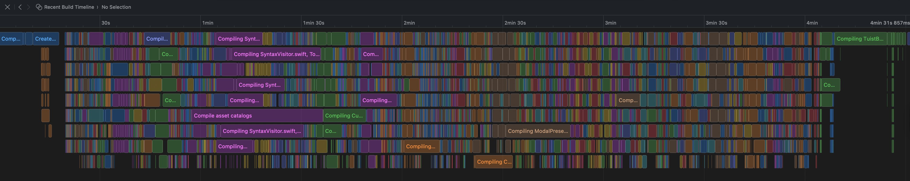
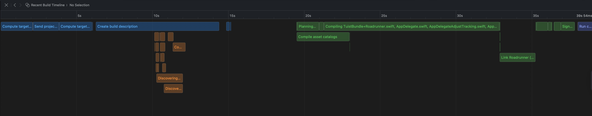

<style>
@font-face {
  font-family: "InstrumentSerif";
  src: url("fonts/InstrumentSerif-Regular.ttf");
  font-style: normal;
  font-weight: 400;
}
@font-face {
  font-family: "InstrumentSerif";
  src: url("fonts/InstrumentSerif-Italic.ttf");
  font-style: italic;
  font-weight: 400;
}
@font-face {
  font-family: "IBMPlexSans";
  src: url("fonts/IBMPlexSans-VariableFont_wdth,wght.ttf");
  font-style: normal;
  font-weight: 100 900;
}
@font-face {
  font-family: "IBMPlexSans";
  src: url("fonts/IBMPlexSans-Italic-VariableFont_wdth,wght.ttf");
  font-style: italic;
  font-weight: 100 900;
}

/* Global slide typography */
section {
  background: white;
  color: #333;
  font-family: "IBMPlexSans";
  font-size: 36px;
  line-height: 1.35;
  padding: 80px 120px;
}

/* Title hierarchy */
h1 {
  font-size: 76px;
  line-height: 1.08;
  letter-spacing: -0.5px;
  margin: 0 0 22px 0;
}

h2 {
  font-size: 56px;
  line-height: 1.12;
  letter-spacing: -0.3px;
  margin: 0 0 18px 0;
}

h3 {
  font-size: 44px;
  line-height: 1.18;
  margin: 0 0 14px 0;
}

h4 {
  font-size: 38px;
  line-height: 1.22;
  margin: 0 0 12px 0;
}

h1, h2, h3, h4 {
  color: #0A0F25;
  font-family: "InstrumentSerif";
  font-style: italic;
}

/* Body text rhythm */
p {
  margin: 18px 0 0 0;
}

ul {
  margin: 18px 0 0 0;
  padding-left: 1.15em;
}

ul li {
  margin: 10px 0;
}

strong {
  font-weight: 650;
  color: #0A0F25;
}

em {
  font-style: italic;
  color: #555;
}

/* Header tweaks */
header img {
  float: right;
  margin-right: 30px;
}

header {
  width: 100%;
}
</style>

# The Fast and the Curious: Optimizing Projects for Maximum Speed

Michael 'Mike' Gerasymenko

Appdevcon 2026

<!-- _paginate: false -->
<!-- ---

# Where I work


Mobile at ElevenLabs
Remotely from Berlin

Read me: [gera.cx](https://gera.cx)


<!-- _header: '' -->
<!-- _footer: '' -->

--- 

# Where I am from

Born in Odesa, Ukraine

Local charity [Monstrov.org](https://monstrov.org/stop-war-in-ukraine/)


---

# What is happening where I am from

https://dou.ua/memorial/

---

# Imagine

→ Close your eyes and imagine
→ Your day is starting
→ Ray of sun is on your work desk
→ The project is open, and you know exactly what you need to do
→ You do the changes and run the project
→ In a snap, your app is launched <!-- and you can see the results of your work -->


---

# Is it easy to imagine?

I can tell for sure my reality is different

---

# Is it impactful?


---

# Thought Leaders


→ Met Peter Steinberger
→ He thinks mobile development is cooked
→ His web projects build and test time is measured in seconds

<!-- _Well, he also thinks we don't need mobile apps all together, but let's focus at one thing at a time._ -->

---

# Have we got used to the current state of affairs?

---

# Let's start from the beginning
<!--
---


<!-- No, not from Objective-C -->
<!-- _header: '' -->
<!-- _footer: '' -->
<!-- _paginate: false -->

---

# Warning! We are going to go through a lot of slides

---

# What actually happens during the build?


<!-- 
---

## Xcode meditate?

## Fans spin? -->

---

# ~~What actually happens during the build?~~

## Not the right question! Let's try "Five Why"'s.

---

**`01`** We need to build an app. Why?
**`02`** CPU cannot run Swift directly. Why?
**`03`** Swift code must be translated to machine code. Why?
**`04`** Translation isn’t “just one step”. Why?
**`05`** Why does this pipeline feel slow and painful in real life?

---

Swift and other programming languages have a human-friendly syntax, device hardware is expecting a hardware-friendly code to execute. Same applies for the resources.

---

# Xcode is trying it's best

And it's getting better over time.

After initial build is complete, next builds are faster. Why?

→ Xcode is trying to reuse results of the former builds to make process faster.

---

# So, Xcode is caching the build results?

Yes, we have a clean build and incremental build.

---

# Why does it still feels slow?

---

# `01` Compiling Swift is generally slower than compiling many other languages

---

# `02` Your project is big and getting bigger

---

# `03` AI is making your project even bigger

---

# Different goals

→ For CI, clean build must be optimized
→ For local development, incremental builds must be fast

---

# Side Note

→ Please don't forget to remove features
→ Start by checking disabled feature flags
→ [peripheryapp/periphery](https://github.com/peripheryapp/periphery) can help


---

# We are going to use three metrics

**`01`** Clean Build
**`02`** Incremental (no changes)
**`03`** Incremental (one file change)

<!-- Let's take the initial value as 100% to help following the improvements. -->


<!-- _paginate: false -->
---

# Local: In Xcode

`defaults write com.apple.dt.Xcode ShowBuildOperationDuration YES`


---

# XCMetrics

→ Usually I would recommend it, but not today
→ Server side component is not building on modern Xcode
→ No updates in two years
→ Spotify moved on? Any Spotify engineers in the audience?

---

# Your CI provider

You probably already know how long your build is taking on the CI, but do you keep track of the build time vs test time?

---

# Upload Telemetry to a Google Sheet

<!-- Something I learned in my startup years is that a Google Sheet could be a surprisingly potent database.
Startup mindset
 -->

```ruby
require "google/apis/sheets_v4"
require "googleauth"
require "googleauth/stores/file_token_store"

// given spreadsheet_id and service_account_json

service = Google::Apis::SheetsV4::SheetsService.new
service.authorization = Google::Auth::ServiceAccountCredentials.make_creds(
          json_key_io: StringIO.new(service_account_json),
          scope: Google::Apis::SheetsV4::AUTH_SPREADSHEETS)

// values_rows contain the values to upload

value_range_object = Google::Apis::SheetsV4::ValueRange.new(majorDimension: "ROWS", values: values_rows)

response = service.append_spreadsheet_value(
          spreadsheet_id,
          stat_name + "!A2",
          value_range_object,
          value_input_option: VALUE_INPUT_OPTION)
```

--- 

# Compile Time Settings

<!-- → Defer dSYM creation
→ Build Active Architecture Only / Architectures
→ Compilation Mode
→ Optimization Level
→ Build system (Legacy/New Xcode 10) -->


<!-- ---

# Baseline -->

---

# dSYM

`DEBUG_INFORMATION_FORMAT[config=Release] = dwarf-with-dsym`
`DEBUG_INFORMATION_FORMAT[config=Debug] = dwarf`

---

# Architectures

`ARCHS = arm64 x86_64`
`ONLY_ACTIVE_ARCH[config=Debug] = YES`

---

# Compilation Mode

`SWIFT_COMPILATION_MODE[config=Debug] = singlefile`
`SWIFT_COMPILATION_MODE[config=Release] = wholemodule`

---

# Optimization Level

`SWIFT_OPTIMIZATION_LEVEL[config=Debug] = -Onone`
`SWIFT_OPTIMIZATION_LEVEL[config=Release] = -O`

---

# Basics done, what Xcode offers to address build time?

→ Xcode 26 Compilation Caching
→ Build Timeline
→ Flags to indicate inter-target dependencies
→ Type Checking Duration

---

# Improving incremental and clean builds: Caching

---

# How hard caching can be?

> There are only two hard things in Computer Science: cache invalidation and naming things.

Phil Karlton


---

# So It's Actually Hard

Xcode needs to do a bunch of work to make sure caching happens correctly. 

It's not always easy.

---

# Xcode 26 Compilation Caching

`Enable Compilation Caching`

---

# Xcode: Build Timeline (clean build)



Editor → Open Timeline

---

# Xcode: Build Timeline (incremental build)



→ Clean build depends on the number of cores
→ Incremental on the core performance

---

# Take Away

Xcode is optimizing to utilize all available CPU cores to distribute the compilation work.

Some tasks cannot be parallelized (linking, code signing, etc.).

---

# High Level Build Steps

Xcode → swift-driver → swift-frontend → LLVM → linker

---

# Swift Driver

→ Analyzes inputs
→ Constructs the compilation plan
→ Schedules compilation jobs
→ Invokes swift-frontend, LLVM, linker, etc.
→ Manages incremental builds and dependencies

<!--
When builds feel slow, we often blame the compiler.
But most of the time, the driver is making conservative decisions because it cannot safely reuse results.

If you change one file:

Driver decides:

👉 only recompile that file
👉 recompile dependent files
👉 rebuild whole module
👉 invalidate downstream modules
-->

--- 

# Xcode: Flags to indicate inter-target dependencies

**`01`** Build Phases → Target Dependencies

**`02`** Library Configuration
`BUILD_LIBRARY_FOR_DISTRIBUTION`
`SWIFT_ENABLE_LIBRARY_EVOLUTION`
`SWIFT_MODULE_INTERFACE`

**`03`** Run Script Input/Output configuration

<!-- When we talk about incremental builds, one hidden problem is how changes propagate across module boundaries.

By default, Swift modules are extremely fragile from a build-system perspective.
A tiny public API change can invalidate every downstream target and force a rebuild of a large portion of your dependency graph.

That’s where these settings come in.

⸻

BUILD_LIBRARY_FOR_DISTRIBUTION enables stable module interfaces.
Instead of depending on compiler-specific binary metadata, downstream targets can rely on a textual interface that survives compiler updates and reduces rebuild churn.

⸻

SWIFT_ENABLE_LIBRARY_EVOLUTION allows a module to evolve without breaking its ABI.
This is especially useful for frameworks and shared modules that change frequently but shouldn’t force massive recompilation of dependents.

⸻

And SWIFT_MODULE_INTERFACE generates .swiftinterface files, which are human-readable module descriptions.
These interfaces make dependency boundaries clearer and help the build system understand what actually changed.

⸻

The important takeaway is not the flags themselves.

The real idea is:

Stable module boundaries reduce cache invalidation and improve incremental builds.

In other words, build speed is strongly influenced by API stability and module design, not just compiler performance.
-->

---

# Warnings for Compilation Duration

Build settings → Other Swift Flags (`OTHER_SWIFT_FLAGS`)

```
-Xfrontend -warn-long-expression-type-checking=100
-Xfrontend -warn-long-function-bodies=100
```

---

# Other Useful Flags 

```
-Xfrontend -debug-time-function-bodies
-Xfrontend -debug-time-compilation
-Xswiftc -driver-time-compilation
-Xfrontend -stats-output-dir
```

<!-- 
When builds feel slow, the instinct is often to guess where the time is going.
But modern Swift compilation is complex enough that guessing usually leads to optimizing the wrong thing.

These flags help turn compilation into something measurable.

⸻

-Xfrontend -debug-time-function-bodies reports how long each function takes to compile and type-check.
This is extremely useful for identifying problematic expressions, especially in SwiftUI or heavily generic code, where a single function can silently add seconds to build time.

⸻

-Xfrontend -debug-time-compilation gives a higher-level breakdown of frontend compilation phases.
It helps answer the question: is the compiler slow, or is a specific part of the pipeline slow?

⸻

-Xswiftc -driver-time-compilation operates one level higher — at the compiler driver.
It shows how long each compilation job takes, which is useful when investigating scheduling, parallelization, or unexpectedly repeated compile tasks.

⸻

And finally, -Xfrontend -stats-output-dir exports structured compiler statistics.
This is more advanced, but it allows teams to aggregate compilation metrics over time and build their own telemetry around build performance.

⸻

 -->


---

# Why Monoliths Are Bad for Incremental Builds

→ Hard for Xcode to understand the cause and effect and dependencies inside of the module.
→ Also, same for humans and AI.

---

# Enter Modularization


<!-- _paginate: false -->

---

# Tuist, Bazel & Buck

| Problem | Xcode native | Tuist | Bazel & Buck |
|--------|--------------|-------|-------|
| Graph clarity | meh | good | strict |
| Remote cache | no | yes | yes |
| Dev friction | low | low | high |
| Migration cost | none | low | extreme |

---

# Resources Packaging


→ Cocoapods are deprecated.
→ Also, cocoapods have a significant issue with asset catalog compilation
→ https://gera.cx/posts/cocoapods-resources

---

# Thank you!


→ Art Institute of Chicago
→ Some AI for style transfer

<!-- _paginate: false -->
<!-- - Dnio by Alvaro Reyes / Unsplash 
- Sunflower by Wolfgang Hasselmann / Unsplash-->
