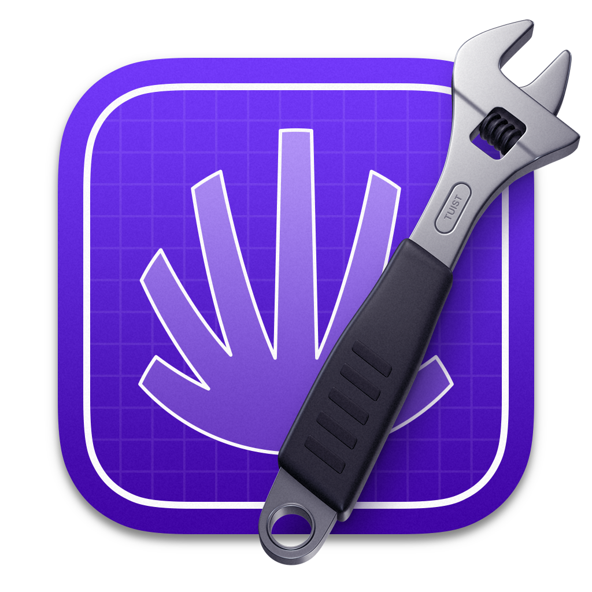
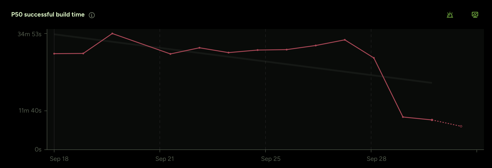

<style>
@font-face {
  font-family: "InstrumentSerif";
  src: url("fonts/InstrumentSerif-Regular.ttf");
  font-style: normal;
  font-weight: 400;
}
@font-face {
  font-family: "InstrumentSerif";
  src: url("fonts/InstrumentSerif-Italic.ttf");
  font-style: italic;
  font-weight: 400;
}
@font-face {
  font-family: "IBMPlexSans";
  src: url("fonts/IBMPlexSans-VariableFont_wdth,wght.ttf");
  font-style: normal;
  font-weight: 100 900;
}
@font-face {
  font-family: "IBMPlexSans";
  src: url("fonts/IBMPlexSans-Italic-VariableFont_wdth,wght.ttf");
  font-style: italic;
  font-weight: 100 900;
}

/* Global slide typography */
section {
  background: #050505;
  color: #F5F5F5;
  font-family: "IBMPlexSans";
  font-size: 36px;
  line-height: 1.35;
  padding: 80px 120px;
}

/* Title hierarchy */
h1 {
  font-size: 76px;
  line-height: 1.08;
  letter-spacing: -0.5px;
  margin: 0 0 22px 0;
}

h2 {
  font-size: 56px;
  line-height: 1.12;
  letter-spacing: -0.3px;
  margin: 0 0 18px 0;
}

h3 {
  font-size: 44px;
  line-height: 1.18;
  margin: 0 0 14px 0;
}

h4 {
  font-size: 38px;
  line-height: 1.22;
  margin: 0 0 12px 0;
}

h1, h2, h3, h4 {
  color: #FFFFFF;
  font-family: "InstrumentSerif";
  font-style: italic;
}

/* Body text rhythm */
p {
  margin: 18px 0 0 0;
}

ul {
  margin: 18px 0 0 0;
  padding-left: 1.15em;
}

ul li {
  margin: 10px 0;
}

pre, code {
  background: #0A0A0A;
  color: #FFFFFF;
  font-family: "Menlo", "IBMPlexSans", monospace;
  font-weight: 500;
  letter-spacing: 0.15px;
}

.hljs-symbol {
font-family: "Menlo", "IBMPlexSans", monospace;
}

pre {
  padding: 26px;
  border-radius: 18px;
  border: 1px solid #3A3A3A;
  box-shadow: 0 30px 70px rgba(0,0,0,0.65);
}

pre code {
  background: transparent;
  color: inherit;
  padding: 0;
}

code {
  padding: 4px 10px;
  border-radius: 8px;
  border: 1px solid #3A3A3A;
}

.hljs {
  color: #F8F8F2;
}

.hljs-keyword,
.hljs-selector-tag,
.hljs-literal {
  color: #FF7EA8;
  font-weight: 600;
}

.hljs-string,
.hljs-title,
.hljs-name {
  color: #8BE9FD;
}

.hljs-comment {
  color: #7E8C99;
}

.hljs-number,
.hljs-attr {
  color: #F1FA89;
}

table {
  width: 100%;
  border-collapse: collapse;
  margin: 28px 0 0 0;
  background: #0B0B0B;
  color: #F0F0F0;
}

th, td {
  border: 1px solid #2A2A2A;
  padding: 16px 20px;
  text-align: left;
}

th {
  background: #141414;
  font-weight: 700;
  color: #FFFFFF;
}

td {
  background: #0F0F0F;
  color: #F0F0F0;
}

tbody tr:nth-child(even) td {
  background: #141414;
}

strong {
  font-weight: 650;
  color: #FFFFFF;
}

em {
  font-style: italic;
  color: #CFCFCF;
}

/* Header tweaks */
header img {
  float: right;
  margin-right: 30px;
}

header {
  width: 100%;
}

section.title {
  position: relative;
  overflow: hidden;
}

section.title::after {
  content: "";
  position: absolute;
  inset: 0;
  background: radial-gradient(circle at 45% 40%, rgba(5,5,5,0.05), rgba(0,0,0,0.8));
  z-index: 0;
}

section.title > * {
  position: relative;
  z-index: 1;
}

section.title h1,
section.title p {
  text-shadow: 0 6px 22px rgba(0,0,0,0.8), 0 0 30px rgba(0,0,0,0.6);
}
</style>

<!-- _class: title -->

# The Fast and the Curious: Optimizing Projects for Maximum Speed
Michael 'Mike' Gerasymenko

Appdevcon 2026


<!-- _paginate: false -->

<!-- Welcome to The Fast and the Curious. I'm Mike Gerasymenko, and over the next forty minutes we'll go deep on making your projects feel fast again at Appdevcon 2026. -->
---

# Who I am

→ Doing iOS since 2009
→ Author of XcodeSelectiveTesting
→ ex. Readdle, Wire, CaraCare, Feeld

Blog: [gera.cx](https://gera.cx)


<!-- I've been building iOS apps since 2009, from Readdle to Wire to Feeld, and I even built XcodeSelectiveTesting—so these scars are coming from real production projects. -->
---

# Where I work


→ Mobile at ElevenLabs
→ Building the Reader App
→ Remotely from Berlin
→ ElevenLabs is hiring, check the website

<!-- _header: '' -->
<!-- _footer: '' -->

<!-- Today I'm a mobile engineer at ElevenLabs in Berlin, working on the Reader App, and yes, we're hiring if this sounds like your kind of challenge. -->
---

# Where I am from

Born in Odesa, Ukraine

Local charity [Monstrov.org](https://monstrov.org/stop-war-in-ukraine/)


<!-- I'm originally from Odesa, Ukraine, and I like to remind people that staying connected to home matters even when we're nerding out on build systems. -->
---

# What is happening where I am from

https://dou.ua/memorial/ 


    

<!-- Here's a quick look at what friends back home are going through—if any of those names are new to you, please take a moment to read about them later. -->
---

# Imagine

→ Close your eyes and imagine
→ Your day is starting
→ The sun is on your work desk
→ The project is open, and you know exactly what you need to do
→ You do the changes and run the project
→ In a snap, your app is launched <!-- and you can see the results of your work -->


<!-- Close your eyes for a second and imagine the perfect dev morning: sunlight on the desk, a fresh cup of coffee, and your change builds instantly. -->
---

# Is it easy to imagine?

I can tell for sure my reality is different.

<!-- For many of us that flow sounds like science fiction, and my day-to-day reality is definitely messier than that ideal. -->
---

# Is it impactful?

<!-- Yet we know quick feedback loops matter, so let's keep that imaginary day in mind while we talk about impact. -->
---

# Thought Leaders


→ Met Peter Steinberger
→ He is not fond of mobile development
→ His web projects' build and test time is measured in seconds


<!-- A while back I met Peter Steinberger, who reminded me that on the web side he gets builds and tests in seconds—so mobile shouldn't accept mediocrity. 

_Well, he also thinks we don't need mobile apps alltogether, but let's focus at one thing at a time._ -->


---

# Have we got used to the current state of affairs?

<!-- We've collectively become numb to slow builds, so this talk is my attempt to shake us out of that complacency. -->
---

# Let's start from the beginning

<!-- To do that we'll rewind to the very basics of what building actually means before we start prescribing fixes. -->
---

# Warning! We are going to go through a lot of slides

<!-- Brace yourself: there are a lot of slides, but I'll keep the pace brisk and the takeaways concrete. -->
---

# What actually happens during the build?


<!-- First let's ask what the build system is actually doing every time you hit run, because it isn't just random fan noise. -->

---

# ~~What actually happens during the build?~~

## Not the right question! Let's try "Five Why's."

<!-- Instead of obsessing over every phase, I want us to focus on the better question behind that strikethrough title. -->
---

**`01`** We need to build an app. Why?
**`02`** CPU cannot run Swift directly. Why?
**`03`** Swift code must be translated to machine code. Why?
**`04`** Translation isn’t “just one step”. Why?
**`05`** Why does this pipeline feel slow and painful in real life?

<!-- We're going to run a Five Whys exercise on compiling so we understand the root causes instead of slapping band-aids on symptoms. -->
---

Swift and other programming languages have a human-friendly syntax, and device hardware is expecting a hardware-friendly code to execute. The same applies to the resources.

<!-- Computers speak machine code, we speak Swift, and everything in between is just translation layers—including resource compilation. -->
---

# Xcode is trying its best

And it's getting better over time.

After the initial build is complete, the next builds are faster. Why?

→ Xcode is trying to reuse the results of the former builds to make the process faster.

<!-- The good news is that Xcode is genuinely trying to help by reusing work from previous builds whenever it can. -->
---

# So, Xcode is caching the build results?

Yes, we have a clean build and an incremental build.

<!-- That means we effectively have two experiences—clean builds and incremental builds—and Xcode caches aggressively to make the second one feel better. -->
---

# Why does it still feel slow?

<!-- But even with caching the process still feels slow, which is why we're all in this room. -->
---

# `01` Compiling Swift is generally slower than compiling many other languages

<!-- First culprit: the Swift compiler is heavy compared to a lot of other languages, especially with generics and type inference. -->
---

# `02` Your project is big and getting bigger

<!-- Second culprit: our projects keep growing in modules, resources, and targets, so there's simply more stuff to compile. -->
---

# `03` AI is making your project even bigger

<!-- And now we're stuffing AI-generated code into those projects, inflating them overnight. -->
---

# Different goals

→ For CI, the clean build must be optimized
→ For local development, incremental builds must be fast

<!-- So we need to separate goals—CI wants predictable clean builds, while developers crave instant incremental feedback. -->
---

# We are going to use three metrics

**`Σ`** Clean Build
**`δ`** Incremental Build


<!-- _paginate: false -->

<!-- I'll use Σ for clean builds and δ for incremental ones so we can talk about improvements with a shared language. -->
---

# Measuring

<!-- Before we change anything we have to measure, otherwise we're just guessing which knob mattered. -->
---

# Local: In Xcode

`defaults write com.apple.dt.Xcode ShowBuildOperationDuration YES`


<!-- Step one is to measure locally: enable the build duration indicator inside Xcode so you always see the timer. -->
---

# Xcode: Build Timeline
## **`Σ`** Clean Build


Editor → Open Timeline

<!-- Then use the Build Timeline view for a clean build to understand which phases dominate. -->
---

# Xcode: Build Timeline 
## **`δ`** Incremental Build


→ **`Σ`** Clean Build depends on the number of cores
→ **`δ`** Incremental Build on the core performance

<!-- Compare that with an incremental build timeline to see how different the shape is, because those optimizations usually diverge. -->
---

# XCMetrics

→ Usually, I would recommend OSS projects, but not today
→ Server-side part is not building on modern Xcode
→ No updates in two years
→ Spotify moved on? Any Spotify engineers in the audience?

<!-- Tools like XCMetrics used to help here, but they're stalled, so be careful before betting your observability on them. -->
---

# Your CI provider

You probably already know how long your build is taking on the CI, but do you keep track of the build time vs test time?

<!-- Your CI provider probably already tracks build vs test time—export that data and watch the trends, not just the last failure. -->
---

# Upload Telemetry to a Google Sheet

<!-- Something I learned in my startup years is that a Google Sheet could be a surprisingly potent database.
Startup mindset
 -->

```ruby
require "google/apis/sheets_v4"
require "googleauth"
require "googleauth/stores/file_token_store"

# given spreadsheet_id and service_account_json

service = Google::Apis::SheetsV4::SheetsService.new
service.authorization = Google::Auth::ServiceAccountCredentials.make_creds(
          json_key_io: StringIO.new(service_account_json),
          scope: Google::Apis::SheetsV4::AUTH_SPREADSHEETS)

# values_rows contain the values to upload

value_range_object = Google::Apis::SheetsV4::ValueRange.new(majorDimension: "ROWS", values: values_rows)

response = service.append_spreadsheet_value(
          spreadsheet_id,
          stat_name + "!A2",
          value_range_object,
          value_input_option: VALUE_INPUT_OPTION)
```

<!-- If you need a lightweight dashboard, ship the numbers to a Google Sheet; it's amazing how far you can get with a simple append script. -->
---

# Let's Make it Faster

<!-- With measurements in place we can finally talk about practical levers to make things faster. -->
---

# Less is More

→ Please don't forget to remove features
→ Start by checking disabled feature flags
→ [peripheryapp/periphery](https://github.com/peripheryapp/periphery) can help


<!-- The lowest-hanging fruit is deleting stuff: retire feature flags, rip out dead code, and let tools like Periphery guide the cleanup. -->
---

# Caching

<!-- Next lever is caching—but we'll do it thoughtfully instead of just flipping random cache toggles. -->
---

# How hard can caching be?

> There are only two hard things in Computer Science: cache invalidation and naming things.

Phil Karlton


<!-- Cache invalidation is famously hard, so if Phil Karlton struggled, it's okay that we do too. -->
---

# So It's Actually Hard

Xcode needs to do a bunch of work to make sure caching happens correctly. 

It's not always easy.

<!-- Xcode shoulders a lot of invisible work—tracking dependencies, timestamps, and previous outputs—to make caching safe. -->
---

# Basic work Xcode does

→ Target dependency graph
→ Swift file dependency tracking
→ Swift incremental compilation
→ Previous build records
→ File timestamp changes

<!-- It tracks target inputs, file dependencies, and build records so it knows when it can reuse compiled artifacts. -->
---

# Common Things to Look at

→ Correct target inputs and outputs
→ Avoid scripts changing files every time
→ Check build timeline


<!-- Our job is to feed it accurate information: declare inputs and outputs correctly so the dependency graph stays trustworthy. -->
---

# Xcode 26 Compilation Caching

Build settings → `Enable Compilation Caching`

→ Xcode stores compiled artifacts keyed by the content of the inputs
→ “Have we ever compiled this exact input before?”

<!-- With Xcode 26 Apple finally exposes compilation caching officially, so let's lean into the tooling instead of fighting it. -->
---

# Compile Time Settings


<!-- From here we'll walk through key build settings because they're the knobs you can touch without rewriting your toolchain. Most of those settings default values are correct, but diff on Xcode project is notoriously hard to read, so you or some of your colleagues might have adjusted them to non ideal configuration -->
---

# dSYM

### Affecting: **`δ`** Incremental

`DEBUG_INFORMATION_FORMAT[config=Release] = dwarf-with-dsym`
`DEBUG_INFORMATION_FORMAT[config=Debug] = dwarf`

Result: decrease incremental builds by ca. 30%

<!-- Start with dSYM generation—deferring them can shave seconds off incremental builds when you don't need symbols locally. -->
---

# Architectures

### Affecting: **`δ`**, **`Σ`**

`ARCHS = arm64 x86_64`
`ONLY_ACTIVE_ARCH[config=Debug] = YES`

Result: decrease any builds by up to 50%

<!-- Architectures matter too: building every slice for every run murders both Σ and δ, so build active architecture when you can. -->
---

# Compilation Mode

### Affecting: **`δ`** Incremental

`SWIFT_COMPILATION_MODE[config=Debug] = singlefile`
`SWIFT_COMPILATION_MODE[config=Release] = wholemodule`

<!-- Compilation modes dictate whether all files in the module compiled together, or each individually. Compiling individually is more performant for incremental builds. -->
---

# Optimization Level

### Affecting: **`δ`** Incremental

`SWIFT_OPTIMIZATION_LEVEL[config=Debug] = -Onone`
`SWIFT_OPTIMIZATION_LEVEL[config=Release] = -O`

<!-- Optimization levels aren't free either—Debug with no optimizations keeps incremental builds happy unless you're profiling. -->
---

# High-Level Code Compilation Steps

Xcode → swift-driver → swift-frontend → LLVM → linker

<!-- Zooming out, it's helpful to remember the high-level pipeline from your project targets down to executable binaries. -->
---

# Swift Driver

→ Analyzes inputs
→ Constructs the compilation plan
→ Schedules compilation jobs
→ Invokes swift-frontend, LLVM, linker, etc.
→ Manages incremental builds and dependencies

<!--
When builds feel slow, we often blame the compiler.
But most of the time, the driver is making conservative decisions because it cannot safely reuse results.

If you change one file:

Driver decides:

👉 only recompile that file
👉 recompile dependent files
👉 rebuild whole module
👉 invalidate downstream modules
-->

<!-- Within that pipeline the Swift Driver orchestrates dozens of frontend jobs, so understanding its phases helps you read logs. -->
---

# Xcode: Flags to indicate inter-target dependencies

**`01`** Build Phases → Target Dependencies

**`02`** Library Configuration
`BUILD_LIBRARY_FOR_DISTRIBUTION`
`SWIFT_ENABLE_LIBRARY_EVOLUTION`
`SWIFT_MODULE_INTERFACE`

**`03`** Run Script Input/Output configuration

<!-- This can come in handy in case you have a modularized multi-target setup.Xcode now exposes flags that declare inter-target dependencies more explicitly, which keeps incremental builds faster. -->
---

# Warnings for Compilation Duration

Build settings → Other Swift Flags (`OTHER_SWIFT_FLAGS`)

```
-Xfrontend -warn-long-expression-type-checking=100
-Xfrontend -warn-long-function-bodies=100
```

<!-- TODO: Screenshot -->

<!-- Use the warning flags for long expression checks—if a function takes seconds to type-check, you'll see it here before CI does. -->
---

# Other Useful Flags 

```
-Xfrontend -debug-time-function-bodies
-Xfrontend -debug-time-compilation
-Xswiftc -driver-time-compilation
-Xfrontend -stats-output-dir
```

<!-- And when in doubt, turn on the profiling flags so you can watch compilation phases, driver timing, and stats output. -->
---

# Dependencies in Swift Package Manager

<!-- Now let's switch gears to dependencies because Swift Package Manager can secretly torpedo clean builds. -->
---

# Swift Package Manager is great

### Affecting: **`Σ`** Clean Build

But you need to be aware of how it works.

→ Package resolution requires dependency repo checkout
→ Dependencies repos might have very big checkouts
→ Gigabytes big

<!-- I love SPM, but remember that resolving packages means cloning entire repos, and some of them are huge. -->
---

# Option 1: Use Package Registry

https://tuist.dev/blog/2025/11/26/opening-registry


<!-- A registry is the cleanest fix: Tuist just opened theirs, and it removes that git clone step completely. -->
---

# Option 2: Cache Checkouts Folder

→ Cache `SourcePackages/checkouts` between CI runs.
→ Use `-clonedSourcePackagesDirPath` flag to point Xcode to the cache.

<!-- If a registry isn't an option, cache your `SourcePackages/checkouts` folder so resolution reuses the bytes you already cloned once. -->
---

## Set clonedSourcePackagesDirPath

```bash
xcodebuild \
  -resolvePackageDependencies \
  -scheme BuildTimeDemo \
  -clonedSourcePackagesDirPath "$HOME/.cache/spm-checkouts"
```

<!-- Point `-clonedSourcePackagesDirPath` to that cache and xcodebuild will happily reuse the checkouts instead of redownloading them. -->
---

# Your CI to cache

GitHub Actions example:

```yaml
- name: Cache SPM checkouts
  uses: actions/cache@v4
  with:
    path: ~/.cache/spm-checkouts
    key: ${{ runner.os }}-spm-${{ hashFiles('**/Package.resolved') }}
    restore-keys: ${{ runner.os }}-spm-

- name: Resolve Swift packages
  run: >
    xcodebuild -resolvePackageDependencies
    -scheme BuildTimeDemo
    -clonedSourcePackagesDirPath $HOME/.cache/spm-checkouts
```

<!-- On CI, pair that flag with an actions/cache step keyed off `Package.resolved` so runners share the same tarball of dependencies. -->
---

# Resources Packaging

→ Resource assembly could be as slow as compilation.
→ Scale poorly in monoliths.
→ Split large asset catalogs into target-specific bundles.
→ Cache downloaded resources outside of Xcode projects.

<!-- Resources deserve the same scrutiny as code—huge asset catalogs and ML models can invalidate caches just as fast as Swift files. -->
---

# Asset Catalog Strategies

→ Use `xcassets` pruning tools to remove unused images.
→ Move marketing-only images into separate, optional bundles.

<!-- Trim those catalogs: prefer vectors, remove unused assets, and split marketing imagery into optional bundles. -->
---

# Cocoapods


→ Cocoapods are deprecated.
→ Also, Cocoapods have a significant issue with asset catalog compilation
→ https://gera.cx/posts/cocoapods-resources


<!-- And while we're here, please stop using Cocoapods for resource-heavy targets; its asset handling slows builds dramatically. -->
---

# Enter Modularization


<!-- _paginate: false -->

<!-- All of this leads to modularization, because smaller modules give the build system less to reason about per change. -->
---

# Why Monoliths Are Bad for Incremental Builds

→ Hard for Xcode to understand the cause and effect and dependencies inside the module.
→ Also, the same for humans and AI.

<!-- Monoliths make it impossible for Xcode or humans to grasp dependencies, so incremental builds end up invalidating everything. -->
---

# The End

<!-- So yes, I show a fake 'The End' slide, but really we're just getting started on structural fixes. -->
---

# The End or...

<!-- What else could we try out ther? -->
---

# What if it were possible

To compile less code, while not removing the code

<!-- Imagine if we could keep every feature yet only compile the slice we just touched—that's the challenge I want in your head. -->
---

# Tuist

→ Declarative project description that keeps modules consistent.
→ Remote binary caching supports local and remote builds.
→ `tuist` generates lightweight workspaces for a single target.
→ Paid, but worth it.



<!-- Tuist is my favorite answer: it's declarative, packs remote caching, and lets you focus a workspace down to the one target you care about. -->
---

# Remote Binary Caching in Practice

With Tuist:

→ On project generation phase, Tuist creates a fingerprint for each target
→ Checks if a prebuild version matching the fingerprint is available locally or from the server
→ Replace targets you are not actively working on with binary representation


<!-- TODO: Add screenshot with binary targets -->
<!-- Under the hood Tuist fingerprints every target, checks caches locally or remotely, and swaps untouched modules for binaries. -->
---

# Bazel & Buck


→ Hermetic builds: every dependency pinned, ideal for massive clean builds.
→ Remote execution + shared cache can make CI builds dramatically faster.
→ Multi-language support keeps app + backend tooling aligned.
→ Requires a dedicated tooling team but pays off at scale.

<!-- If you need something even more advanced, Bazel and Buck deliver hermetic, multi-language builds with remote execution for teams willing to invest. -->
---

# Tuist, Bazel & Buck

| Problem | Tuist | Bazel & Buck |
|--------|-------|-------|
| Graph clarity | good | strict |
| Remote cache | yes | yes |
| Dev friction | low | high |
| Migration cost | low | extreme |

<!-- Use this comparison as a gut-check: Tuist favors ergonomics, while Bazel and Buck go all-in on strict graphs and shared caches. -->
---

# Personal Experience

I went with Tuist in one of my former companies 
→ CI **`Σ`** Clean Build went from 35 to 11 minutes
→ **`δ`** Incremental Build went from 30 to 15 seconds



<!-- In practice these numbers are real—one team I worked with took CI clean builds from thirty-five to eleven minutes and halved incremental builds after adopting Tuist. -->
---

# Take Away

→ Less code is better
→ Faster CPUs are not going to save us
→ Modularize your app

<!-- So the takeaways are simple: delete ruthlessly, modularize aggressively, and remember that faster CPUs alone won't rescue us. -->
---

# Thank you!
<!--  -->
Feedback here:


Illustrations: Art Institute of Chicago, Adrien Olichon, Some AI for style transfer

<!-- _paginate: false -->

<!-- Thanks again for joining—scan the QR code for feedback and come chat if you want to geek out about build systems. -->