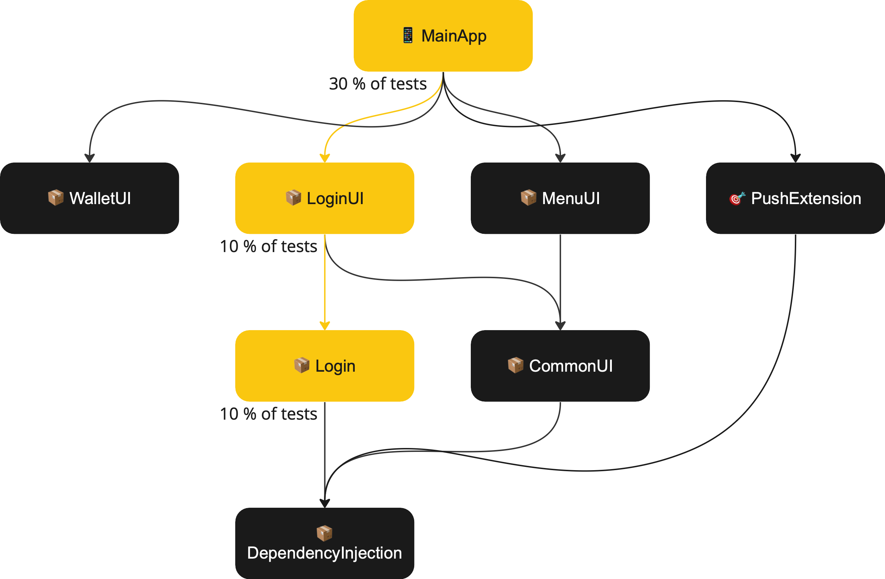

<style>
@font-face {
    font-family: "Poppins-Bold";
    src: url("theme/fonts/Poppins/Poppins-Bold.ttf");
}
@font-face {
    font-family: "Poppins";
    src: url("theme/fonts/Poppins/Poppins-Regular.ttf");
}
section {
  background: white;
  font-family: "Poppins";
  font-size: 10;
}
h1 {
  font-size: 36;
}
h1, h2, h3 {
  font-family: "Poppins-Bold";
  color: #d61f27;
}
</style>

# 
#
#
#
#
#
#
#
#

# <span style="background-color:white;">&nbsp;Mike Gerasymenko, Rider Transmission &nbsp;</span>
# <span style="background-color:white;">&nbsp;iOS CI build performance optimizations &nbsp;</span>


---

# Summary

A series of build optimizations were implemented for the iOS Rider application. 

Those optimizations improved CI build time and build time for the engineers.

CI build time is especially significant, going from ca. 30 minutes per build to 5 on average.


---

## What usually contributes to the CI build time?

- Step 1: Test execution
- Step 2: CI Machine type
- Step 3: Compilation


---

# Step 1: Test execution


---

# Modules

The Rider application is modularized using Swift Package Manager (around 40 modules in total)


---

# Change

If the `📦Login` module is changed, it would only affect the `📦LoginUI` and the `📱MainApp`.



---

# Does it make sense to test all the modules if we know only the `📦Login` module has been changed?

Absolutely no. If the module was not changed, and not using the changed modules we can skip testing it.

---

# We can only run 50% of the tests and get the same results.


---

# But how can we know?

### 1. Detecting what is changed

Well, Git allows us to find what files were touched in the changeset. 

```bash
Root
├── Dependencies
│   └── Login
│       ├── ❗️LoginAssembly.swift
│       └── ...
├── MyProject.xcodeproj
└── Sources
```

---

### 2. Build the dependency graph

Going from the project to its dependencies, to its dependencies, to dependencies of the dependencies, ...

Can be achieved with _xcodeproj_ gem or a similar library.

Dependencies between packages can be parsed with `swift package dump-package`.

_BTW, This is the moment the Leetcode graph exercises would pay off_

---

## 2.5. Save the list of files for each dependency

This is important, so we'll know which files affect which targets.

---

## 3. Traverse the graph

Go from every changed dependency all the way up, and save a set of dependencies you've touched.


---

## 4. Disable tests that can be skipped in the scheme / test plan

This is actually the hardest part. Dealing with obscure Xcode formats. But if we get that far, we will not be scared by 10-year-old XMLs.

---

# Overview


- [Pull Request Link 🔗](https://github.com/deliveryhero/logistics-rider-app-ios/pull/2746)

---

## Step 1: Results

| Execution type / minutes          | Unit tests duration | Snapshot tests duration | Total duration | Improvement per run |
|-----------------------------------|---------------------|-------------------------|----------------|---------------------|
| Old                               | 15 min              | 10 min                  | ca. 32-35 min  | n/a                 |
| New (only Roadrunner changed)     | 10 min              | 10 min                  | ca. 26 min     | 5 min               |
| New (no files in targets changed) | 20 sec              | 20 sec                  | ca. 7 min      | 25 min              |

---

## Step 1: Build examples


---

## Step 1: Big picture


---

# Step 1: Summary

We went from consuming 30 minutes per build on average to ca. 20 minutes per build (conservative estimation).

This optimization allows the company to save ca. 30% of CI build credits for Pull Request builds for future years.


---

# Step 2: CI Machine Type

In September 2022, we received an opportunity to test Bitrise Apple Silicon workers.


---

They were, in average, 50% faster in compiling and test our project:


---

# Effectiveness

However, they were also more expensive. We decided to find out if they are a good bang for the buck.


---

# Methodology

We were able to switch the CI machine type. For the second and third weeks of October 2022, we switched CI machines to Intel cheaper workers and collected daily statistics on credit consumption per build. 

We have different build types and bi-weekly release cadence, which should give us a representative result.

[Analysis Sheet Link 🔗](https://docs.google.com/spreadsheets/d/1DZTPO7IDkZEPlgceNLPedXtcoHHsdbxybE-ZuyTtWok/edit#gid=759604376)

[Pull Request Link 🔗](https://github.com/deliveryhero/logistics-rider-app-ios/pull/3205)


---


---

# Step 2: Summary

CI credits use: With Bitrise Apple Silicon "Elite" machines, we are making builds 2x faster and saving ca. 14% Bitrise credits on all build types.

**Engineer focus**: PR check pipeline time went from 20 minutes to ca. 11 minutes.


---

# Step 3: Compilation

---

# Why build the same things over and over again?

> “Insanity is doing the same thing over and over and expecting different results.”

Albert Einstein


---

# Same Input + Same Process = Same Output

This optimization idea is used in many places. So when building the same source files with the same compiler, we should get the same binaries. 

Essentially, we'll cache the build results.


---

# What we'll do

We'll move from using external dependencies compiled by SPM at build time, to using pre-compiled versions of the same dependencies.


[Pull Request Link 🔗](https://github.com/deliveryhero/logistics-rider-app-ios/pull/3228)

---

# Step 3: Stats


--- 

# Step 3: Results

We made every build compile ca. 4 minutes faster (on CI and cold builds on engineer's machines).

CI credits use: We are using 36% fewer CI credits on a typical PR check pipeline.

Engineer focus: going from 11 to ca. 7 minutes per build (almost no time to make tea while CI compiles ☕️).


---

# Summary

We started from spending ca. 32-35 minutes per PR checks pipeline on the CI.

Now Rider Application is compiled and tested on the CI in average 2-7 minutes.

In 7 minutes we execute ca. 2300 unit tests and two critical UI tests.

In case the change is not relevant to the code, build takes only 2 minutes.


---

# State Feb 2023


---


---

# CI Impact

| | |
|:----|----|
| Saved to date (2022) | 67 CI days |
| Projected saving in the next years | 124 CI days per year |
| CI price saved to date (2022) | ca. 5.000 EUR |
| Projected saving in the next years | ca. 10.000 EUR per year |
| CO₂ emissions saved to date (2022) | ca. 60 kg |
| Projected saving in the next years | ca. 120 kg per year |

---

# Engineer Productivity Impact

| | |
|:----|----|
| Saved to date (2022) | 67 work days |
| Projected saving in the next years | 124 work days per year |
| CI price saved to date (2022) | ca. 128.000 EUR |
| Projected saving in the next years | ca. 237.000 EUR per year |

---

# Going forward (Vision)

## Build performance

Thanks to the modular structure, we are able to go beyond what we have now.

We can ship pre-compiled modules, only building from the source the module engineer is currently working on.

---

# Going forward (Vision)

## Testing what changed

Analyze the scope of the new release. Regression testing would rely on the information about which modules were changed in the current release.

We can execute less tests on the modules that were not directly changed.

We can skip testing modules that were not affected by any change.

---

## Thanks for listening!

## Questions
