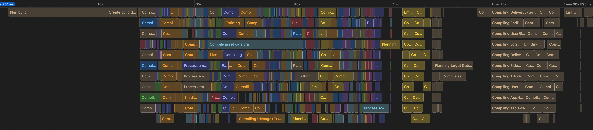

<style>
@font-face {
    font-family: "Poppins-Bold";
    src: url("theme/fonts/Poppins/Poppins-Bold.ttf");
}
@font-face {
    font-family: "Poppins";
    src: url("theme/fonts/Poppins/Poppins-Regular.ttf");
}
section {
  background: white;
  font-family: "Poppins";
  font-size: 10;
}
h1 {
  font-size: 36;
}
h1, h2, h3 {
  font-family: "Poppins-Bold";
  color: #d61f27;
}
</style>

# Caching external SPM packages

Cocoaheads Berlin January 2023


---

# Who I am

Hey, I'm Mike. I am originally from Ukraine 🇺🇦.

I started as an iOS engineer in 2009 at Readdle. Worked at Wire, Cara Care and Feeld.

Twitter: [@gk0io](https://twitter.com/gk0io)
Github: [mikeger](https://github.com/mikeger)
Email: mike@gera.cx


---

# What is happening?

https://war.ukraine.ua/donate/

You know what to do. Thank you.


---


# Where I work

I am a Staff iOS engineer at Delivery Hero Logistics:

- Available in 75 countries
- Serving 1M delivery drivers monthly

We are constantly hiring mobile engineers. Reach out if you are interested. Or apply [here](https://careers.deliveryhero.com/global/en/job/JR0032021/Staff-iOS-Engineer-f-m-d-Client-Foundation).

---


<!-- header: '' -->
<!-- footer: '' -->

---

#### Previous talks around this topic

# Moving a large project from Cocoapods to Swift Package Manager

A video and a text version of this post from Cocoaheads Berlin September 2022 is available, here:

https://gera.cx/posts/move-to-spm

<!-- header: '' -->

---

# Build times

- So far, the highest impact was Apple Silicon, on CI and local
- Still much slower than on web development
- Takes up momentum, pushes out of the flow

-> Let's try to improve it


<!-- If you are a Mobile Engineer like me, you’re likely extremely excited about Apple Silicon computers. They are performant and energy-efficient, but above all, they allow you to build your projects faster and without jet engine fan sounds. However, even with this improvement, the compilation times are very far from what you are getting in web development. Building locally, or on the CI, takes up momentum and can occasionally push you out of the flow, decreasing overall productivity.

Luckily, there are a couple of improvements for build time. -->

---

## Looking at the build timeline

Xcode 14 feature can provide insights over build times and thread utilization



---

## What takes up compilation time?

For our product, out of 10 minutes build time, around half spent building external SPM dependencies.

We are doing it on every clean build: 
- Every CI run
- Clean + Build on developer machines

Additonally, it does not change that frequently


<!--

Looking at the build logs and build timeline available in Xcode 14, I see that from the 10 minutes it takes to compile my project, around half of the time is spent building external dependencies. 
-->

---

## Why build the same things over and over again?

> “Insanity is doing the same thing over and over and expecting different results.”
Albert Einstein


---

## Same Input + Same Process = Same Output

This optimization idea is used in many places. So when building the same source files with the same compiler, we should get the same binaries. 

Essentially, we'll cache the build results.


<!-- 
If you process the same input, using the fixed process and configuration, you can usually expect the same output. This optimization idea is used in many places. The most basic would be caching: save the web page generated in the cache, to serve it again if requested a second time. This idea lays the foundation for something called hermetic build systems, like [Bazel](https://bazel.build/basics/hermeticity). So when building the same source files with the same compiler, we should get the same binaries.
-->

---

# Wait Mike, this is Bazel

I am not ~~crazy~~brave enough to move from the vendor build system. Let's see what is possible to achieve in the world of **Swift Package Manager** with the existing tools.

Wait, I am sure I've seen similar tools before. Where was it?

---

# Reinventing Carthage

[Carthage](https://github.com/Carthage/Carthage) allows this! Carthage is another package management tool that was created before SwiftPM. Carthage is building external dependencies and packaging them as binary XCFrameworks. Why not use it?


---

# What we'll do

We'll move from using external dependencies compiled by SPM at build time, to using pre-compiled versions of the same dependencies:

1. Define external dependencies in the `Cartfile`
2. Build external dependencies to `XCFramework`
3. Package all dependencies in your repo using `git-lfs`
4. Add logic to unpack the dependencies if required


---

# Hm

But wait, would this mean we will be using two different package managers?

Yes, but wait to see the full picture, we will only need to use Carthage when we would need to change the libraries' versions.


---

# Let's get building

The first step would be to define the `Cartfile`, which is just a Carthage way of defining the list of dependencies.

You can see the list of the packages your project relies on in the Project preferences pane, inside Xcode.

You would end up with something like this in your `Cartfile`:

```bash
github "https://github.com/Alamofire/Alamofire.git" == 5.4.1
github "https://github.com/SwiftyJSON/SwiftyJSON.git" == 5.0.0
github "https://github.com/vadymmarkov/Fakery" == 5.0.0
github "https://github.com/SDWebImage/SDWebImage.git" == 5.8.2
```


---

## Install and run Carthage

Carthage can be installed from Homebrew, using `brew install carthage`.

Then you'll need to run `carthage bootstrap --use-xcframeworks --platform <Your platform, for exmaple iOS>`. Carthage would then fetch your dependencies defined in `Cartfile` and sub-dependencies. Then it would find binaries for them (if provided) or would compile them from sources. In the end, you would get all of them compiled into `XCFramework` format.


---

## Expose the frameworks to Swift Package Manager

`XCFramework` is nice, but if you are using Swift Package Manager for local modules, you would need to carry out one additional step: create a package that will expose those dependencies. This is necessary, since you cannot declare a dependency on a bare framework in your file system: it has to be declared as a Swift Package Manager package.

This can be achieved by defining one `Package.swift` for all of the XCFrameworks.

---

## Package Manifest

```swift
// swift-tools-version:5.3
import PackageDescription

let package = Package(
    name: "Contrib",
    platforms: [
        .iOS(.v11)
    ],
    products: [
        .library(
            name: "Alamofire",
            targets: ["Alamofire"]
        ),
        ...
    ],
    targets: [
        .binaryTarget(
            name: "Alamofire",
            path: "Alamofire.framework"
        ),
        ...
    ]
)
```


---

## Folder structure

In the end, we'll have the following file structure:

```bash
Root
├── Cartfile
├── Carthage
│   └── Build
│       ├── Alamofire.xcframework
│       ├── Fakery.xcframework
│       ├── Package.swift
│       ├── SDWebImage.xcframework
│       └── SwiftyJSON.xcframework
├── MyProject.xcodeproj
├── Sources
└── setup.sh
```


---

## Package and store the binary frameworks

Carthage is going to put the frameworks to `Carthage/Build`. This is where we can take them and archive them. As an example, you can use the [tar](https://support.apple.com/en-gb/guide/terminal/apdc52250ee-4659-4751-9a3a-8b7988150530/mac) command:

```bash
tar cvzf Contrib.tar.gz Carthage/Build
```


---

## Git LFS

[Git LFS](https://git-lfs.com) is a Git extension intended to make it easier to keep large-ish files in Git. Certainly, it's possible to just add such files to Git normally, but it is not the best idea, as it would make your repo bigger and bigger the more versions of a given file you add.

Installing and using Git LFS is extremely easy:

```bash
brew install git-lfs
git lfs install
```

Then, let's add our archive to Git LFS:

```bash
git lfs track Contrib.tar.gz
git add .gitattributes
```

---

## Prepare the frameworks for use

We need to think of other engineers who would be interacting with the repository. It's a good idea to create a setup script that would make sure the Git LFS extension is installed and would pull the dependencies file. I will use tar as an example here again:

```bash
brew install git-lfs
git lfs install
git lfs pull
tar -xvf Contrib.tar.gz
```

---

## Referring from Swift Package Manager

Since we have `Package.swift` now, we can refer from local Swift packages or Xcode projects to our binary frameworks. In your local package, it would look like this:


---

## In your existing packages:

```swift
// swift-tools-version:5.3
import PackageDescription

let package = Package(
    name: "CommonUI",
    platforms: [
        .iOS(.v11)
    ],
    products: [
        ...
    ],
    dependencies: [
        ...
        .package(path: "../../Contrib")
    ],
    targets: [
        .target(
            name: "CommonUI",
            dependencies: [
              .product(name: "SDWebImage", package: "Contrib"),
            ],
            path: "Sources"
        )
    ]
)
```


---

# Bottomline

As a result of this exercise, our team decreased the CI build and test time from 10 to 6 minutes. This has a significant effect on multiple verticals:

- A much faster feedback loop on the pull requests
- Saving money on the CI credit
- Less CO₂, since we need to spin the CPU less
- Since it is faster to build the project locally, there is less chance for an engineer to lose focus
- Satisfaction from not rebuilding Firebase over and over: priceless

---

# Q&A

## QQ: Should one consider switching to Carthage altogether?

In my opinion no, because Swift PM allows for modularization.

---

## QQ: Why use XCFramework format, specifically?

This format, in comparison to a regular `framework`, allows the packaging of several binaries of the same architecture for different SDKs. In practice, this means Apple Silicon simulator support.

---

## QQ: Any additional effect from this?

One of the effects of this optimization is that the dependencies are now dynamic frameworks. This has pros and cons:

- If you have multiple targets, every target would be able to link to the frameworks without growing in size. Static frameworks would be included in every target multiplying the size.

- Dynamic frameworks negatively affect your app's startup time. iOS takes some time to load dynamic libraries on the app startup.

--- 

## Thanks for listening!


---

## Thanks Grammarly for hosting
I use Grammarly daily. Also for this presentation.

---

## More questions?

Companion post here https://gera.cx/posts/cache-spm

Twitter: [@gk0io](https://twitter.com/gk0io)
Github: [mikeger](https://github.com/mikeger)
Email: mike@gera.cx
