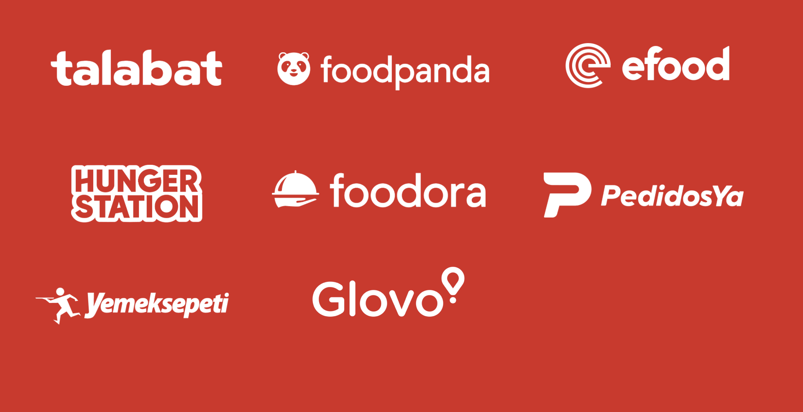

<!-- map: center=[0, 0] zoom=1 -->

# Escaping the performance Bermuda Triangle

## Optimizing integrations with the Mapbox Navigation SDK

**Michael Gerasymenko**

**Delivery Hero**

*Bitrise Build 2025*

---

<!-- map: center=[31.1656, 48.3794] zoom=5 highlight=UKR -->

# About Me

*   From Ukraine
*   iOS Developer since 2009
*   Master of Applied Mathematics

---

<!-- map: center=[13.4050, 52.5200] zoom=10 -->

# My Company: Delivery Hero

*   Working in Berlin
*   Developing the Rider application
*   Used in ~70 countries worldwide

---

<!-- map: center=[0, 0] zoom=1 highlight=KHM,LAO,MMR,KOR,BGD,HKG,SGP,PAK,PHL,MYS,TWN,AUT,CYP,CZE,FIN,NOR,HUN,SWE,GRC,TUR,BOL,CRI,DOM,ECU,GTM,HND,NIC,PAN,PRY,SLV,URY,VEN,CHL,PER,ARG,IRQ,BHR,OMN,JOR,QAT,EGY,ARE,KWT,SAU,BIH,MNE,MDA,BGR,HRV,UGA,ROU,KEN,SRB,CIV,NGA,PRT,GEO,POL,MAR,TUN,ARM,KGZ,KAZ,ESP,AND,ITA,UKR -->

# Delivery Hero's Global Presence

This slide highlights the countries where Delivery Hero operates.

---

# What is a performance?

---

# 