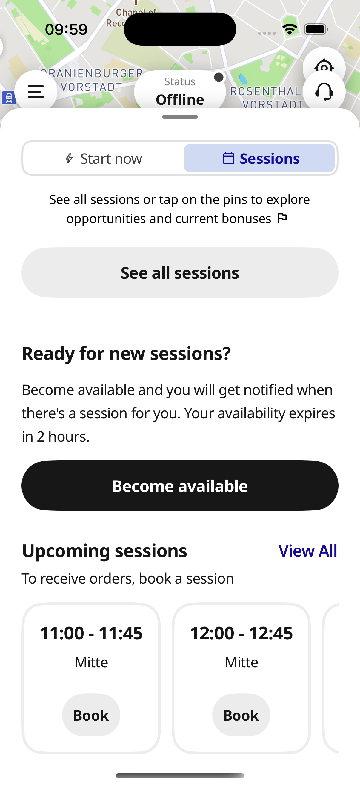
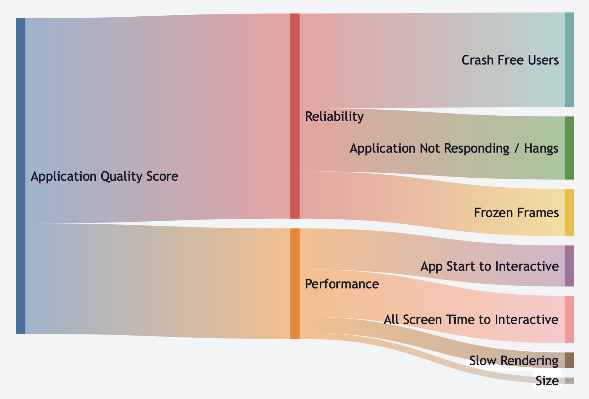
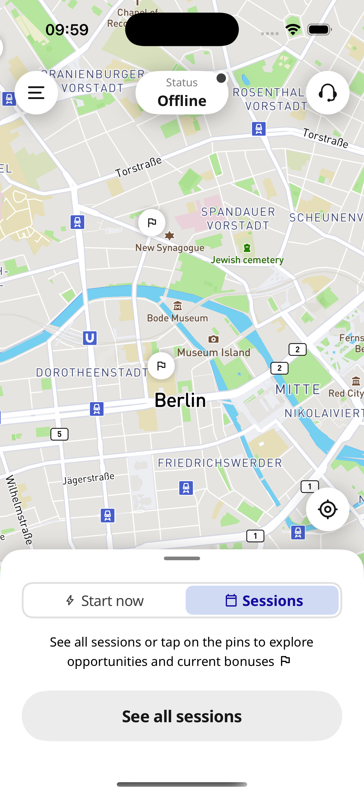
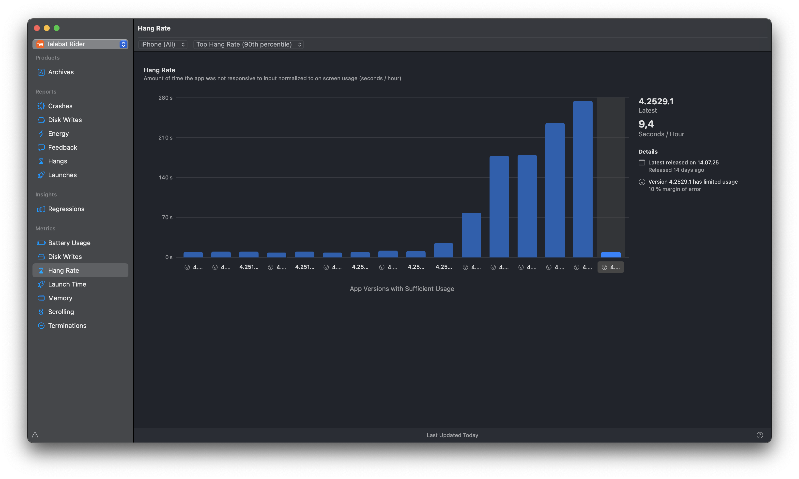

---

<!-- map: center=[0, 0] zoom=1 -->

# Escaping the performance Bermuda Triangle

## Optimizing integrations with the Mapbox Navigation SDK

**Michael Gerasymenko**

**Delivery Hero**

*Bitrise Build 2025*

---

<!-- map: center=[31.1656, 48.3794] zoom=5 highlight=UKR -->

# About Me

* Originally from Ukraine
* iOS Developer since 2009
* MSc Applied Mathematics
* I have experience working on SDKs myself developing Onfido iOS SDK

---

<!-- map: center=[13.4050, 52.5200] zoom=10 -->

# Where I work: Delivery Hero

* HQ in Berlin
* Part of Logistics, developing the Rider application
* Used in ~70 countries worldwide

---

<!-- map: center=[0, 0] zoom=1 highlight=KHM,LAO,MMR,KOR,BGD,HKG,SGP,PAK,PHL,MYS,TWN,AUT,CYP,CZE,FIN,NOR,HUN,SWE,GRC,TUR,BOL,CRI,DOM,ECU,GTM,HND,NIC,PAN,PRY,SLV,URY,VEN,CHL,PER,ARG,IRQ,BHR,OMN,JOR,QAT,EGY,ARE,KWT,SAU,BIH,MNE,MDA,BGR,HRV,UGA,ROU,KEN,SRB,CIV,NGA,PRT,GEO,POL,MAR,TUN,ARM,KGZ,KAZ,ESP,AND,ITA,UKR -->

# Delivery Hero Countries

* Truly global usage of the Rider App

--- 

# Rider App

* Source of income for hundred thousands of riders
* Must be extermely reliable, as any quality issue is keeping riders from delivering food and is imapcting the company directly

---

# What is a performance?

* Different people would see it differently
* In general, you would know that performance is bad when you see it
* How to formally define it?

---

# Enter Application Quality Score (AQS)

* Developed in Delivery Hero in-house
* Delivery Hero has 14 apps which are all reporting AQS
* Competition is strong 🎉

---

# Performance in AQS

* App start to interactive (p90)
* All screens time to interactive (p90)
* Frozen frames
* Slow rendering
* Crash-free users -- not really performance
* App Hangs rate
* App size

---

# How big is the usage of Mapbox in the Rider App?

* It's almost always visible on the screen
* We are using Mapbox Navigation SDK as well

---

# How big is the impact of Mapbox on the AQS?

* App start to interactive -- SDK initialization
* Frozen frames, Slow rendering, App Hangs rate -- SDK performance
* Crash-free users -- SDK crashes
* App size -- SDK size

---

# Enter Bermuda Triangle

* Leadership

<!-- map: center=[25.0, 71.0] zoom=5 highlight= -->

---

# What are the expectations from adding an SDK to the app?

* I am yet to see an SDK that improves the performance

---

# Concepts of Ownership

* Locus of control
* Learned helplessness

---

# Locus of control

---

# Learned helplessness

---

# Antipatterns

* Throwing issues over the fence

---

# Breaking out of the bermuda triangle

* Work with the SDK developers
  * Learn best practices
  * Share detailed bug reports
* Telemetry for performance
* Be careful with new SDK releases
  * Use Beta releases, analyze the telemetry

---

# Trench story: Indefinite hang

--- 

# Thank You!

## Questions?
