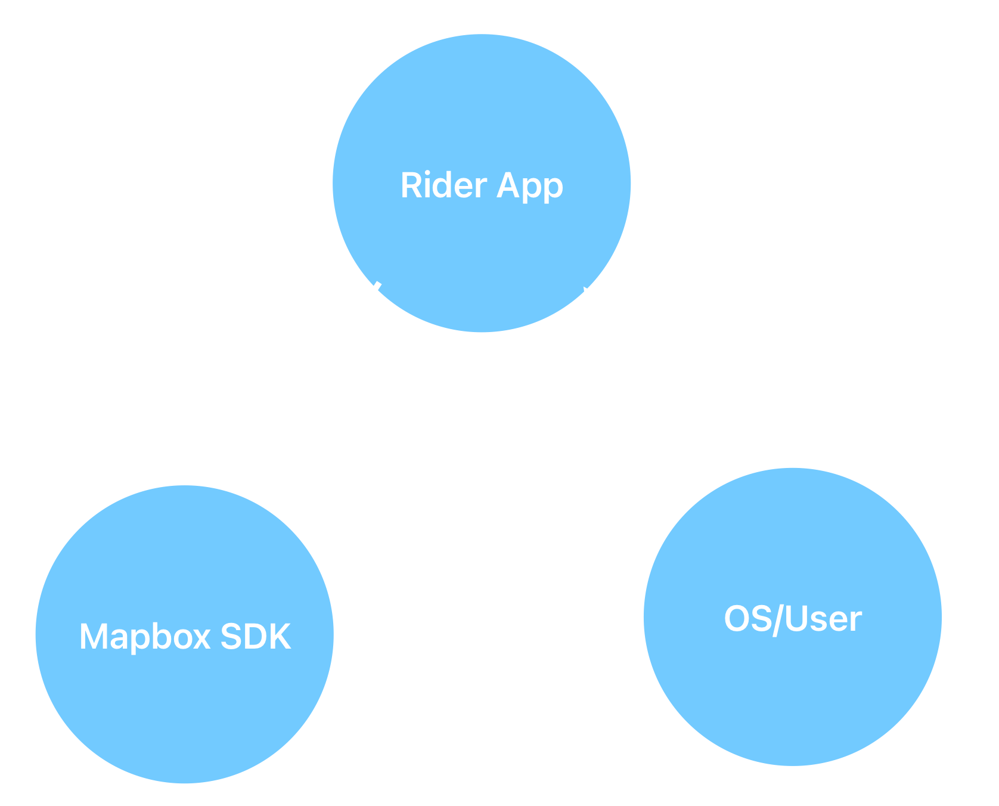

---

# Why not use Mapbox for presenting about Mapbox?

---

<!-- map: center=[0, 0] zoom=1 -->

# Escaping the performance Bermuda Triangle

## Optimizing integrations with the Mapbox Navigation SDK

Michael Gerasymenko, Delivery Hero

### Bitrise Build 2025

## Permanent link: https://gera.cx/mapbox/

---

<!-- map: center=[31.1656, 48.3794] zoom=5 highlight=UKR -->

# Michael Gerasymenko

* Originally from **Ukraine**
* iOS Developer since 2009
* MSc Applied Mathematics
* I have experience working on **SDKs** myself developing Onfido iOS SDK

---

<!-- map: center=[13.4050, 52.5200] zoom=10 -->

# Where I work: Delivery Hero

* HQ in Berlin
* Part of Logistics, developing the Rider application
* Used in ~70 countries worldwide

---

<!-- map: center=[0, 0] zoom=0.75 highlight=KHM,LAO,MMR,KOR,BGD,HKG,SGP,PAK,PHL,MYS,TWN,AUT,CYP,CZE,FIN,NOR,HUN,SWE,GRC,TUR,BOL,CRI,DOM,ECU,GTM,HND,NIC,PAN,PRY,SLV,URY,VEN,CHL,PER,ARG,IRQ,BHR,OMN,JOR,QAT,EGY,ARE,KWT,SAU,BIH,MNE,MDA,BGR,HRV,UGA,ROU,KEN,SRB,CIV,NGA,PRT,GEO,POL,MAR,TUN,ARM,KGZ,KAZ,ESP,AND,ITA,UKR -->

# Delivery Hero Countries

--- 

# Rider App

* **Source of income** for hundred thousands of riders
* Must be extermely reliable, as any quality issue is keeping riders from delivering food and is imapcting the company directly

---

# What is a performance?

* Different people would see it differently
* In general, **you would know that performance is bad when you see it**
* How to formally define it?

---

# Application Quality Score (AQS)

* Compound metric developed by Delivery Hero in-house (0-100)
* Delivery Hero has 14 apps which are all reporting AQS: **Competition is strong** 🎉

---

# How App Performance is reflected in AQS

* App start to interactive (10 points)
* All screens time to interactive (10 points)
* Frozen frames (13 points)
* Slow rendering (5 points)
* Crash-free users — not really performance (35 points)
* App Hangs rate (25 points)
* App size (2 points)

---

# Rider App performance challenges

The Rider app is used in extreme conditions:

* Frequently riders are using **old devices**
* The app is running for **8-10 hours** during the work shift
* Riders are working outside, devices are frequently experiencing **extreme heat**
* Device has to be **charged** during the shift, which is adding up to the heat

---

# How big is the usage of Mapbox?

* It's almost **always visible** on the screen
* We are using Mapbox **Navigation** SDK as well

---

# How big is the impact of Mapbox on the AQS?

* App start to interactive — SDK initialization
* Frozen frames, Slow rendering, App Hangs rate — SDK performance
* Crash-free users — SDK crashes
* App size — SDK size

---

# Bermuda Triangle

Hangs are happening in the app, the **leadership is not happy**, but we cannot do anything as the code is foreign for us.

---

# What are the expectations from adding an SDK to the app?

> To be honest, I have yet to see an SDK that improves the performance

---

# Let's talk about ownership: Locus of control

* Definition: **Ownership** means taking responsibility for the outcome, even if the code originates from a third-party SDK.
* Why it matters in SDK integration:
  * You control how the SDK is used, how it’s initialized, and how it interacts with your app.
  * Leadership sees results when your team takes initiative instead of waiting for the SDK provider to fix issues.
* Key mindset shift:
  * From “It’s Mapbox’s problem” → “How can we manage, mitigate, and improve its impact on our app?”

---

# Let's talk about ownership: Learned helplessness

* Problem: Developers often assume “foreign code = out of my hands.”
* Effect: Delays in bug resolution, frozen frames, hangs, crashes — directly impacting AQS.
* Adopt proactive ownership:
  * Profile SDK behavior in your context.
  * Collect telemetry and report actionable insights.
  * Implement workarounds when SDK limitations affect your app.
* Outcome: Reduces blind spots, empowers the team, improves app reliability and performance.

---

# Breaking out of the Bermuda Triangle

* Mapbox is not a **black box**
  * Learn best practices
  * Share detailed bug reports with Mapbox
* **Telemetry** for performance
* Be careful with **new SDK releases**
  * Use Beta releases, analyze the telemetry
* If Mapbox cannot fix it, may be **you** can?
  * Profile the SDK and share learnings with Mapbox

---

# War stories: Indefinite hang

## Warning: This is technical!

As we implemented turn by turn navigation in the Rider App, there was obviously something off.

--- 

# Indefinite hang: AQS

Coincidentally, at the same time, we've introduced the Hang Rate to the AQS score... And our app was the worst in the whole Delivery Hero 😳

---

# Indefinite hang: Investigation

We started investigating what could have caused this, and there was a clear correlation with the rollout of the turn by turn navigation.

However, on the developer machines, all is working perfectly well.

---

# Investigation

* Telemetry
  * Using Sentry, we analyzed the logs of the hanging code
  * Strack traces highlighted issues with general UI performance
* Sharing issue with Mapbox
* Real-life testing (dogfooding)
  * We can see that in real-life testing the app is getting slow, but it's not possible to debug while delivering food
* Let's review the integration code!

---

# Integration code

Using debugger and code review, we found the source of the issue, and it was not Mapbox (at least to a certain extent)

* iOS Navigation UI is styled with a iOS7-times technology called `UIAppearance`
* Something similar to CSS, where we are telling UIKit how to style elements
* We would like to change this style
* When the navigation header is re-created, we apply styles from Mapbox and our own styles
* Mapbox is propagating header udpates every 1s

→ This is not ideal to re-create the view every 1s, but this would not bring the app to a choke

---

# UIAppearance

I've had experience with UIAppearance, therefore, I knew it could be dangerous:

* `UIAppearance` is never clearing obsolete styles
* Hence, the more we are setting styles, the more of the styles are accumulated in the process memory
* However, the memory footpring is not a concern here
* When ANY new view is created, `UIKit` must check if any styles are applying for it
* Has to go through all registered styles
* If we are registering a bunch of styles every 1s, over time creating ANY new view would take more than 500ms

---

# Key takeaways

* SDKs are not magic bullets: Integration matters more than the feature itself.

* Ownership matters: Take responsibility for the SDK’s impact on your app.

* Collaboration improves results

* Learn the SDK’s behavior
	
* Incremental & careful integration

---

# Thank You!

> Happy to answer your questions, please share your thoughts!
