# Rider Puls: Realtime Update

## Keeping rider + backend truth aligned

<!--
Good morning! Rider Pulse is our promise that the rider’s phone and our backend stop playing broken telephone. This PoC shows we can keep shifts, orders, and payouts fresh without asking riders to do the hokey‑pokey in the app. I’ll walk through the pain we had, what we built, what Finland is telling us, and how we roll it out wider. Expect fewer buttons and more actual realtime.
-->

---

## 2025: Farewell Refresh Button

- Retired manual refresh so app stops feeling static.
- Smart polling (60s cadence) fills the gap but adds load.

<!--
Last year we pulled the panic button. Riders used to hammer refresh the moment orders slowed down, which made the app feel like a glorified screenshot. Removing the button forced us to rely on smart polling that keeps refreshing every 60 seconds after the latest event. It cured the frantic tapping habit but increased backend traffic by about two thirds, and the data is still up to a minute old when a change sneaks in after a poll.
-->

---

## Problem: Shared State Drift

- Distributed system, but UI still 60s behind worst case.
- Smart polling removed refresh button but spiked backend load.

<!--
Our riders operate inside one logical system that happens to live half in the cloud and half in their pockets. In the RFC we called out that “always fresh” is not a nice-to-have but an operational requirement. Smart polling hits every 60 seconds, which still lets reality drift for an entire minute if the update arrives just after a poll or the rider goes offline. Bonus fun: removing the refresh button boosted backend requests by roughly two thirds, so we bought more load and still shipped stale truth.
-->

---

## Problem: Notifications Can't Cover Everything

- Push is best-effort + limited scope.
- Missed notification => wait for next poll.

<!--
Push notifications are like postcards: charming, delayed, and definitely not for payroll information. We refuse to spam riders with every tiny mutation, especially around earnings or background-only events, and Apple happily throttles us whenever it feels protective. When a crucial push for a stacked order or a PUDO task vanishes, the rider just sits until the next poll. That delay shows up in acceptance time and the dreaded Delivery Not Seen tickets.
-->

---

## Where Drift Happens

- Parallel channels fall out of sync.

<!--
This picture is basically our current marriage counseling session: push and polling work independently, and both assume the other one remembered the anniversary. Either channel can silently fail, which means riders wait up to 60 seconds for truth to catch up. Stacked deliveries make the mismatch painfully visible because the backend knows about a new order while the UI is still finishing its coffee.
-->

---

## Solution So Far: Good, Not Enough

- Push + polling keeps parity but strains the infrastructure

<!--
The hybrid play kept us alive: APNS wake-ups plus smart polling gave us eventual consistency while we shipped the map UI. But it depends on Apple’s cloud, riders’ connectivity, and a lot of redundant RiderHome fetches. Even on a good day we still allow up to a minute of drift and torch backend resources. It’s like using both belt and suspenders yet still losing your pants.
-->

---

## The New Solution: Realtime Connection

- Single socket channel keeps RiderHome hot.

<!--
Enter the realtime connection: a single socket that keeps RiderHome in sync without begging for manual refreshes. `Realtime.ConnectionManagerImpl` babysits everything—client state, auth, lifecycle, reachability—so the app always knows if the pipe is healthy. Every message marks rider data dirty and immediately triggers RiderHome refresh with the right trigger, which cuts the “wait for the next poll” joke from our vocabulary.
-->

---

## Architecture Snapshot

- Gateway streams deltas; app fans out.

<!--
On the backend we produce deltas instead of whole novels, send them through the Realtime Gateway, and the socket feeds `ConnectionManagerImpl`. The manager republishes connection state via AsyncMulticastStream and nudges RiderHome to refresh only the bits that matter. If deltas stop arriving we notice instantly, instead of waiting for a rider to shout “my app is lying.”
-->

---

## Background Mode Support

- Lifecycle-aware sockets stay online on shift.

<!--
Riders don’t stay in our app—navigation, camera, music, you name it—so the socket needs to behave like a patient friend. `AppStateObserver` signals when we slide into the background so we keep the connection alive during shifts. As soon as we pop back into the foreground we reuse the cached token and shrink the reconnect delay, which closes that nasty gap where a rider accepted an order while the app was on a quick detour.
-->

---

## Fallback & Resiliency

<!--
When the network gods misbehave we don’t panic: the manager uses exponential backoff and checks reachability so we’re not hammering the socket while the phone is in airplane mode. After the configured attempts we gracefully fall back to smart polling and mark state invalid so the UI stays honest. Offline riders still get a consistent snapshot, and the moment the socket resurrects they jump straight back to realtime without drama.
-->

---

## Additional Implementation Notes

- Auth-aware, jitter-free, observable.

<!--
`ConnectionManagerImpl` is basically caffeine for sockets—it watches token refreshes, reauthenticates quietly, and avoids the “disconnect everything” tantrums. Every incoming message resets the reconnect delay so we don’t flap between states when traffic slows down. And the debug snapshot gives QA the knobs and timers without begging for a special build, which keeps feature-flag archaeology to a minimum.
-->

---

## How RiderHome Refreshes

- Socket stays alive during shifts + any foreground session.
- Socket event immediately reloads Home API (`socket_event` trigger).

<!--
When a rider is on shift we leave the socket connected even if the app slips to the background for maps or camera. Off shift, we keep it live whenever the app is foregrounded. The moment the backend sends an event we refresh Home API with the dedicated `socket_event` trigger, so the state refresh is tied to the realtime message instead of guesswork. Think of it as “if the pipe talks, the app listens.”
-->

---

## Local Notifications Today & Tomorrow

- Home API refresh feeds local notifications instantly.
- Non-PoC goal: suppress remote push when socket is healthy.

<!--
Our local notifications module observes the Home API fetch, so as soon as realtime triggers a refresh we emit the relevant in-app notification without waiting for APNS. For the production rollout we’ll also signal the backend when the rider is connected so we can mute redundant remote pushes—no more double buzz for the same delivery. One realtime channel, fewer angry riders, happier on-call engineers.
-->

---

## Finland A/B Test: In Progress

- Reliability + speed lifts across board.
- Load on Home API already down 42%.

<!--
Finland is our friendly canary and it’s singing. Delivery Not Seen incidents per delivery dropped sixteen percent, reaction time fell from 6.6 to 5.4 seconds (stat sig, so not just caffeine), background push acknowledgements ticked up to 98.5%, and foreground delivery acknowledgements are basically perfect at 99.92%. Acceptance rate nudged up, reassignment and redispatch went down, and rider accepting time improved almost two percent. Oh, and Home API traffic is down forty-two percent, which makes our backend very happy.
-->

---

## Next Steps: Q1 2026

- **Me**: Bigger-country A/B + iOS offline indicator.
- **Acceptance**: Android client + Live Activity on realtime.
- **PUDO**: Android offline indicator.
- **OTW**: Notification suppression + shared shift state.
- Partner with @Richa Mohan on Fundamentals-related A/B test.

<!--
Q1 is about scale and symmetry. I’ll take the A/B test to a larger country and ship the iOS offline indicator so riders can actually see when realtime is taking a nap. Delivery Acceptance Squad kicks off the Android implementation (once Hakan returns from a well-earned break) and plugs Live Activity into the same stream. PUDO mirrors the offline indicator on Android, OTW suppresses duplicate pushes for riders with sockets, and Richa and I line up a Fundamentals-flavored experiment once the shift/rider propagation is ironclad. Plenty of coffee will be involved.
-->

---

## Next Steps: Later 2026

- Stream GPS via realtime, drop manual refreshes.
- Expand realtime triggers to payments, cashback, tasks.

<!--
Beyond Q1 we move from PoC to lifestyle: stream GPS through realtime so we can retire periodic uploads, stop forcing manual refresh every time the app foregrounds, and let the socket be the adult in the room. Then we hand the same pipe to payments, cashback, and geofence tasks so squads can delete their bespoke polling gremlins. Imagine a world where “did you pull to refresh?” is no longer tech support’s first question.
-->

---

## Battery Impact Snapshot

- ~1.5% mean drain delta vs. control.
- Guardrails ready if >2% delta.

<!--
Battery is the second question every rider asks right after “do I get more orders?” Egor crunched the data, tossed out legacy builds and the goofy one-second sessions, and we’re seeing about a 1.5% mean drain delta. That sits inside our guardrail, but we keep a kill switch primed if it crosses two percent. The dashboard shot is there so nobody has to interpret raw SQL in a meeting.
-->

---

# Thank you!

Let’s keep riders and backend on the same page.

<!--
That’s the story. Happy to answer anything about metrics, rollout plans, or which coffee kept the socket alive this long. The ask is simple: keep pushing realtime coverage, watch the Finland dashboards, and ping me if you spot drift creeping back in. Also, yes, we officially retired the refresh button—may it rest in museum mode.
-->
