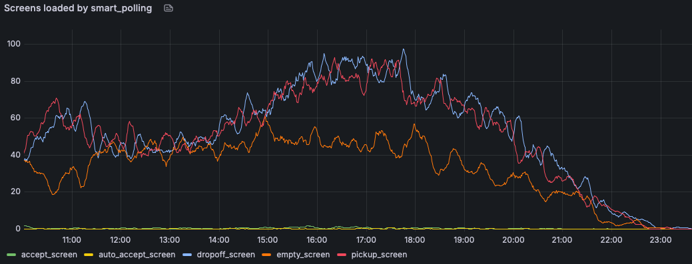
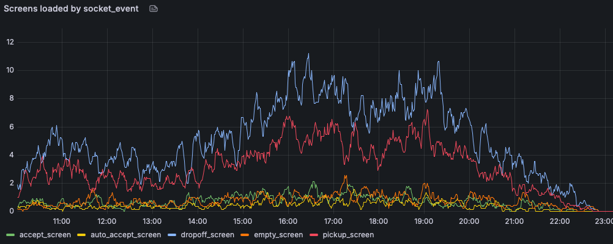
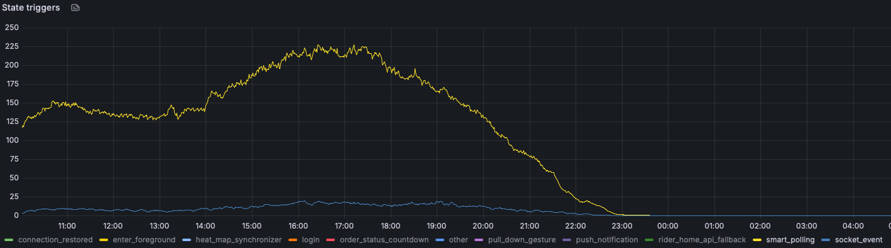
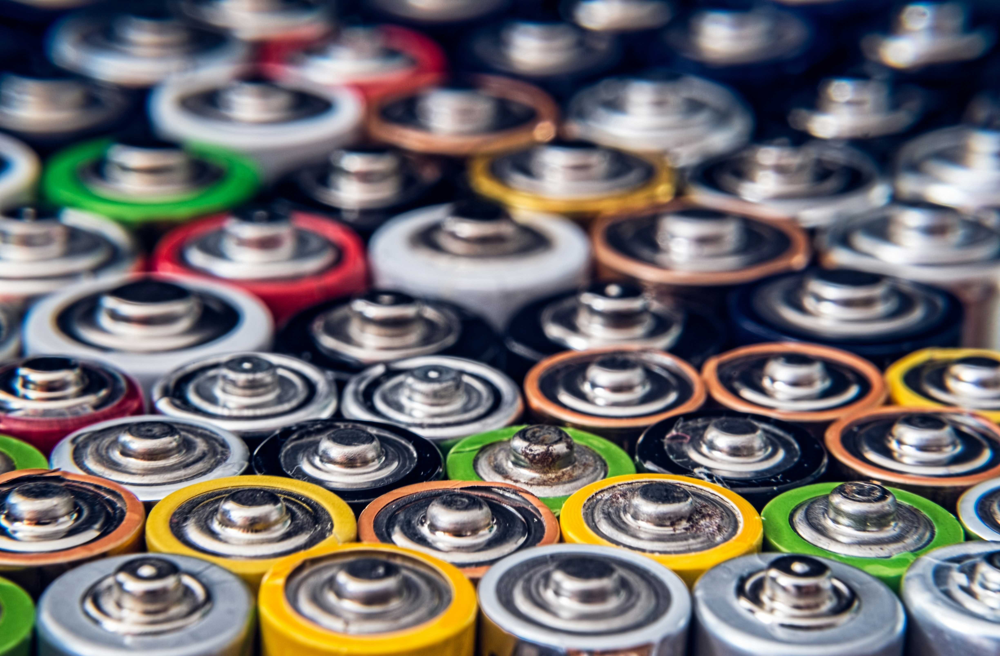

# Slide to start the recording

---

# Rider Pulse: Realtime Updates

## Keeping rider state and backend truth aligned

<!--
Rider Pulse addresses a core systems problem: the rider app and backend reality drift apart. This PoC demonstrates that we can keep shifts, orders, and everything else aligned in near‑realtime without manual refreshes, excessive polling, or unreliable pushes. This talk covers what broke, what we built, early results from Finland, and how this evolves into a shared platform capability.
-->

---

## We Removed Refresh — and Paid for It

- Manual refresh retired to avoid static-feeling UI.
- Smart polling (60s cadence) became the primary fallback.
- Backend request volume increased significantly.

<!--
Removing the refresh button was the right UX decision, but it exposed a deeper systems issue. Riders no longer controlled freshness, so we leaned on smart polling every 60 seconds. That removed frantic tapping, but increased backend load by roughly two thirds and still allowed up to a minute of stale state.
-->

---

## The Core Problem: Shared State Drift

- Distributed system with time-based UI updates.
- Worst-case UI lag of 60 seconds.
- Increased load without correctness guarantees.

<!--
From the rider’s perspective this is one system. Technically, it is split across devices, networks, and services. Polling provides eventual consistency, not correctness. If an update arrives just after a poll, we drift for a full minute while still paying the cost.
-->

---

## Push Notifications Are Not a Consistency Mechanism

- Best-effort delivery and OS throttling.
- Limited scope and frequency by design.
- Missed push means waiting for the next poll.

<!--
Push notifications are intentionally unreliable. We do not send pushes for every mutation. When a critical push is missed, the rider waits until the next poll. That delay shows up in acceptance time and Delivery Not Seen issues.
-->

---

## Where Drift Happens Today

- Push and polling operate independently.
- Either channel can silently fail.

<!--
Polling and push assume the other channel worked. When one fails, the UI waits. This becomes especially visible with stacked deliveries or rapid state changes, where the backend has moved on but the app has not.
-->

---

## Current State: Works, But Scales Poorly

- Push plus polling achieves eventual parity.
- High backend load and persistent drift windows.

<!--
The hybrid approach kept us functional, but it depends on the push behavior, network quality, and frequent RiderHome fetches. Even under ideal conditions we still allow up to a minute of inconsistency and pay for it in backend traffic.
-->

---

## Introducing Rider Pulse

- A single, persistent connection for rider state signals.
- Event-driven freshness instead of time-driven refreshes.

<!--
Rider Pulse introduces a realtime channel that signals when rider-relevant state changes. The app no longer guesses when to refresh. When the backend knows something changed, the UI is notified immediately.
-->

---

## PoC Scope / Limitations

- Only for iOS
- Only delivery state events are published

---

## Architecture Overview

<!--
Backend services publish deltas through the Realtime Gateway. The client connection feeds ConnectionManagerImpl, which exposes connection state and triggers targeted RiderHome refreshes. Refreshes happen because something changed, not because a timer fired.
-->

---

## How Backend Posts Events to the App

- New backend service: `real-time-comms`.
- Producers call `sync(rider_id)` to trigger a client update.
- Payload is currently a freshness signal; state still comes from Home API.
- Supports multiple devices for single rider

<!--
Today, squads do not publish directly to the socket gateway. Instead, they call into the `real-time-comms` service, which is responsible for fanning out a realtime signal to the specific rider connection. The current integration point is a `sync` call with the rider ID; that tells the system “this rider’s state changed, refresh now.” We intentionally keep the payload small and treat it as a freshness signal, so the client continues to fetch authoritative state from Home API.
-->

---

## Realtime Contract (v1)

- Delivers signals, not authoritative state.
- Guarantees freshness when connected.
- Automatically falls back to polling.
- Never blocks rider workflows.

<!--
Rider Pulse is not a pub-sub bus and not a state store. It is a freshness signal. When it is available, the UI stays aligned. When it is not, the system degrades gracefully to existing mechanisms.
-->

---

## Client-Side Implementation Highlights

- Keep the connection open during shift on background and foreground.
- Off-shift only in foreground.
- Exponential backoff on reconnect attempts.
- Reconnect on token expiration with a fresh auth token.

<!--
On the client, the implementation focuses on correctness under real-world mobile conditions: the connection stays open when it matters (on shift and while foregrounded), reconnects do not thrash the network thanks to exponential backoff, and auth is handled explicitly. When the token expires, we refresh credentials and re-establish the connection without forcing a full app restart or degrading into long stale periods.
-->

---

## Background and Lifecycle Support

- Socket remains active during shifts.
- Lifecycle-aware reconnect behavior.

<!--
Riders regularly leave the app for navigation, camera, or calls. During an active shift the connection stays alive in background. On foreground return, cached auth and reduced reconnect delay close the freshness gap.
-->

---

## Failure Handling and Resiliency

- Reachability-aware reconnect with backoff.
- Explicit fallback to smart polling.
- UI marked as potentially stale when needed.

<!--
When connectivity degrades we avoid aggressive reconnects. After configured attempts we fall back to polling and mark state as invalid. Riders still see a consistent snapshot, and the system returns to realtime immediately once the connection recovers.
-->

---

## How Rider Home API Refreshes

- Realtime event triggers Home API refresh.
- Dedicated `socket_event` refresh reason.

<!--
When a realtime message arrives we immediately refresh Rider Home API using a dedicated trigger. Refreshes are causally linked to backend events instead of periodic guesses.
-->

---

<video src="images/trimmed_realtime_update.mov" controls width="100%"></video>

---

## Polling behavior

---

## Socket behavior

---

## Nubmer of reloads

- 1/4 of riders are using the socket connection

---

## Notifications: Today and Next

- Home API refresh drives local notifications.
- Long-term goal: stop sending remote push when socket is connected.

<!--
Local notifications already observe Home API updates, so realtime-triggered refreshes produce immediate in-app notifications. In production we plan to signal backend connectivity to stop sending redundant remote pushes when the socket is healthy.
-->

---

## Future Vision: Delta-Driven Client Updates

- Move from “signal then refetch” to “apply delta then reconcile.”
- Client maintains the last known state and applies server deltas safely.
- Home API becomes a periodic integrity check and fallback, not the hot path.

<!--
The current model is intentionally conservative: realtime tells us that something changed, and Home API remains the source of truth. Longer-term, we can reduce load and latency further by delivering structured deltas that the client applies on top of the last known state. The client would still reconcile with Home API on a schedule or on suspected inconsistencies, but the default path becomes incremental updates rather than full refetches.
-->

---

## Finland A/B Test: Early Results

- Home API traffic down 42%.
- Delivery Not Seen incidents down 16%.
- Reaction time improved from 6.6s to 5.4s.
- Acceptance rate up, reassignment down.

<!--
Finland serves as a controlled environment. Results are statistically significant and consistent across metrics. Backend load reduction is already visible alongside faster rider reactions and fewer missed deliveries.
-->

---

## Battery Impact

- Mean drain delta ~1.5% vs control.
- Guardrail at 2% with kill switch ready.

<!--
Battery impact was measured after excluding legacy builds and short sessions. The observed delta remains within predefined guardrails, with a kill switch available if thresholds are exceeded.
-->

---

## Next Steps: Q1 2026

- Platform: larger-country A/B + offline indicator.
- Consumers: Android client, Live Activity integration.
- Infrastructure: notification logic, shared shift state.
- Partnership with Fundamentals for follow-up experiments.

<!--
Q1 focuses on scale and symmetry across platforms. The goal is to make Rider Pulse a dependable platform capability rather than a country-specific experiment.
-->

---

## Beyond Q1 2026

- Stream GPS updates from the client via realtime.
- Stop all other refreshes if the socket is active (coming to the foreground, etc.).
- Expand realtime coverage to other use cases (quests, work opportunities, etc.).

<!--
Longer-term, realtime becomes the default signal for rider-facing state changes. Polling becomes a fallback, not the primary driver.
-->

---

# Thank You

<!--
The ask going forward is to treat realtime as the primary freshness signal, observe the Finland dashboards, and extend coverage responsibly. Rider Pulse is infrastructure, not a feature.
-->

[Project Folder](https://drive.google.com/drive/u/0/folders/1fh7udftIY-VQB8zoOADF-flvkQikTzEe)
[Comms Dashboard](https://dashboards.syslogistics.io/d/aa8401c2-2635-41d2-b631-4d2ee6228633/rider-real-time-comms?orgId=1&from=now-24h&to=now&timezone=browser&var-app=rider-real-time-comms&var-env=production&var-region=eu-west-1&var-country=fi&var-fleet=$__all&var-pod=$__all&var-prom_region=eu-west-1&editIndex=0&refresh=10s)
[Polling Dashboard](https://dashboards.syslogistics.io/d/f6199306-3682-4868-b533-841501777cbc/smart-polling-realtime-connection?orgId=1&refresh=30s&var-env=production&var-region=$__all&var-country=fi&from=now-24h&to=now&timezone=browser)
[A/B Test Monitoring](https://tableau.deliveryhero.net/#/site/GlobalStandardReporting/views/RiderAppExperimentsMonitoring/DeliveryKPIsOverview?:iid=1&:redirect=auth)
[Slack Channel](https://deliveryhero.enterprise.slack.com/archives/C09H8U0S3KK)

### Time for questions

