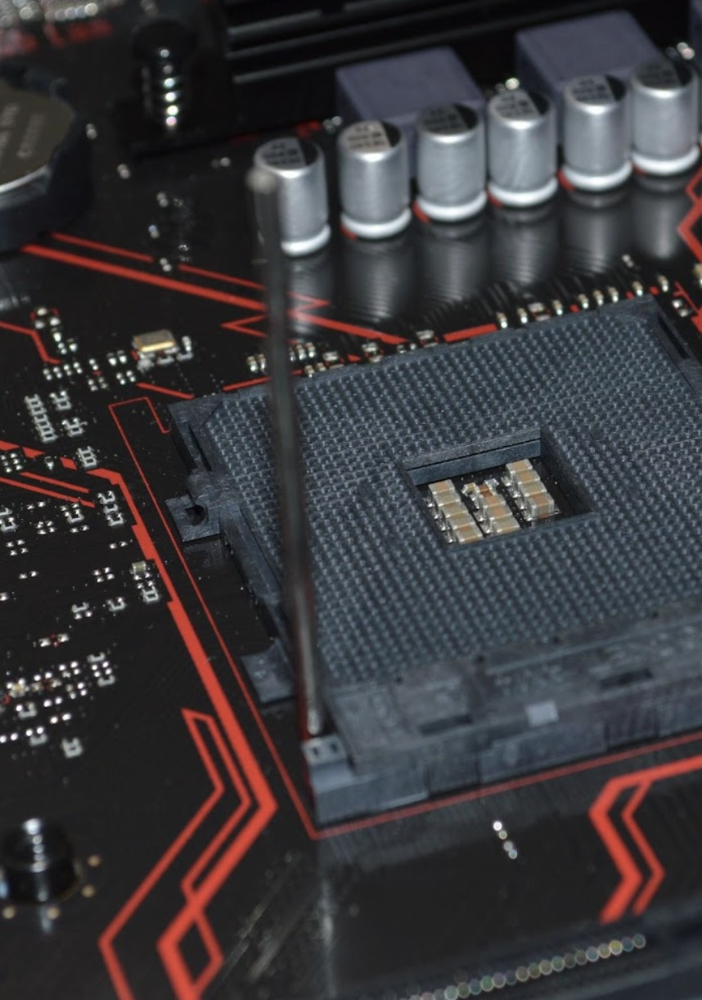

<style>
@font-face {
    font-family: "Poppins-Bold";
    src: url("theme/fonts/Poppins/Poppins-Bold.ttf");
}
@font-face {
    font-family: "Poppins";
    src: url("theme/fonts/Poppins/Poppins-Regular.ttf");
}
section {
  background: white;
  font-family: "Poppins";
  font-size: 10;
}
h1 {
  font-size: 36;
}
h1, h2, h3 {
  font-family: "Poppins-Bold";
  color: #d61f27;
}
</style>

### Moving bigger project to Swift Package Manager (SPM)

Cocoaheads Berlin October 2022


---

<!-- paginate: true -->
<!-- footer: 'Moving bigger project to Swift Package Manager <br> Mike Gerasymenko @gk0io' -->

# Who I am

Hey, I'm Mike. I am originally from Ukraine 🇺🇦.

I started as iOS engineer in 2009 at Readdle. Worked at Wire, Cara Care and Feeld.

Twitter: [@gk0io](https://twitter.com/gk0io)
Github: [mikeger](https://github.com/mikeger)
Email: mike@gera.cx


---

# What is happening?

https://war.ukraine.ua/donate/

You know what to do. Thank you.


---


# Where I work

I am a Staff iOS engineer at Delivery Hero Logistics:

- Available in 75 countries
- Serving 1M delivery drivers monthly

We are constantly hiring Staff+ mobile engineers. Reach out if you are interested. Or apply [here](https://careers.deliveryhero.com/global/en/job/JR0032021/Staff-iOS-Engineer-f-m-d-Client-Foundation).

---


<!-- header: '' -->
<!-- footer: '' -->

---
## <!-- paginate: false -->

<!-- paginate: true -->
<!-- header: '' -->
<!-- footer: 'Moving bigger project to Swift Package Manager <br> Mike Gerasymenko @gk0io' -->

# What is it about?

> Swift Package Manager (SPM) is a tool developed by Apple for managing distribution of Swift code.

I've moved our Rider app (ca. 300K SLOC, 16 external dependencies) to Swift Package Manager.

I would start with the key points and go in-depth at the end of the presentation.

There is a companion post here:
https://gera.cx/posts/move-to-spm

---

# Plan

- SPM: Summary of pros and cons
- SPM in-depth
- Migration plan
- My wishlist for the future
- Cheat sheet


---

# SPM: good to know

- Compilation time: there seem to be no measureable difference that I've noticed between Cocoapods and SPM
- App size stays the same
- Startup time: a bit faster, since it's using static frameworks


---

## SPM: What I find good

Swift as a first-class citizen: packages are defined in Swift.
For the local packages:

- It is possible to add and remove files on the fly, Xcode can figure out the updates
- Xcode understands the changes that are happening and recalculates the dependencies if needed



---

## SPM: What I find good

- No need for `xcworkspace` anymore (unless you have multiple projects)
- It is possible to use an automatically created `Bundle.module` reference when looking for the bundle resources inside of a module


---

## SPM: Good: Adding a dependency

- Integration in Xcode: to change or add a dependency, in the project on the right select the project -> Package Dependencies


---

## SPM: What I can tolerate, but good to know

- Frequent issues `Missing package product for ...`
- Package resolution takes a lot of time
- It is necessary to import Foundation and UIKit when they are used in your source files

---

## SPM: What can be improved

- SPM is doing full checkouts of dependencies repositories
- Dependencies are defined inside of the `project.pbxproj`
- A lot of warnings from the frameworks that are not possible to suppress


---

## SPM: Was it worth it?

I think personally it was still worth it. SPM allows for creating a better modular project structure, it is fast to add new packages and the package format is transparent to engineers.


---

# In-depth

Once the basic things are out of the way, we can take a deeper look on the SPM and the migration.

---

# Why SPM was introduced

- Filling the gap in the ecosystem: Swift on Linux
- CocoaPods and Carthage as predecessors
  - Terrible experience before them
- CocoaPods are effectively just pulling the sources in
- Carthage supporting binary distribution

<!-- SPM was introduced to fill the gap in the Swift ecosystem. Swift is intended as a general-purpose programming language, and the fact that there was no package manager on Linux created a need for SPM to be introduced. -->
<!-- On Mac, the most prominent SPM predecessors were Cocoapods and Carthage. I recall working on iOS projects before Cocoapods and it was a true nightmare. However, Cocoapods are based on a lot of magic, since they modify the project file and adjust build settings. In its essence, Cocoapods is pulling the dependency sources and configuring a separate Xcode project to build those sources in the way that a product of this build can be used in the main project. Then those two projects are connected with a Workspace, so Xcode can understand where the dependency library should be coming from.

Carthage is working in a very different way, building dependencies to frameworks, so those binary frameworks can be used by Xcode in the linking process.

SPM is much better integrated with Xcode and other build tools (as you might expect since it's an Apple product). It is pulling the dependency sources and creating an invisible project, much like Cocoapods would do.
-->

---

# Starting setup: local packages + external deps


---

# How to approach migration to SPM

I had to go all-in with the migration. You don't have to.


---

## Step 1: Current dependencies overlook

I've had to go with the following steps:

- List all external and internal dependencies
- Find which versions of those dependencies are providing SPM support
  - If a library version used already supports SPM, we are good
  - If a library needs to be updated, check the release notes of the versions we need to go over.
  <!-- This can be done as a separate task, i.e. you can update to the needed version with your existing package manager and let it be tested for compatibility with your app. -->
  - If a library does not support SPM at all, fork it and introduce SPM to it.
  <!-- Then, when you are confident it is working, create a pull request from your fork to the upstream repo. Let other engineers enjoy the SPM support you've developed! -->

In the end, you would need to have a list of dependencies and versions you would like to use.

---

## Step 2: Remove Cocoapods (can be done later)

Cocoapods are usually deeply integrated with the project through the xcconfigs and build steps. If you would like to have a clean slate, it is necessary to remove cocoapods before we would start integrating SPM packages. This can be easily achieved via [pod deintegrate](https://guides.cocoapods.org/terminal/commands.html#pod_deintegrate).

```bash
sudo gem install cocoapods-deintegrate cocoapods-clean
pod deintegrate
pod cache clean --all
```

You can also remove Podfile, Podfile.resolved and the workspace if you are not using it for anything else than Cocoapods.

If you would like to go step by step, you can always remove one dependency and add it via SPM.

---

## Step 3: In Xcode, add the dependencies from step 1

- In Xcode, select File -> Add Packages... menu item
- Use the top right search field to enter the git repo path for your dependency
- Let Xcode find the repository
- Select dependency rule. I recommend using exact versions to make sure your build is reproducible
- Click on "Add Package" and let Xcode do its magic

---

## Step 4: Migrating the local and in-house packages (if any)

Moving from Cocoapods [podspec manifest](https://guides.cocoapods.org/syntax/podspec.html) to an SPM [Package.swift](https://developer.apple.com/documentation/xcode/creating-a-standalone-swift-package-with-xcode) is a breeze. I find it quite self-explanatory, so please look at the example migration I've taken for an internal package:


---

### Cocoapods podspec

```ruby
Pod::Spec.new do |s|
  s.name         = "MyChatModule"
  s.version      = "1.0.0"
  s.summary      = "Module for MyChatModule"
  s.description  = ""
  s.homepage     = "https://www.deliveryhero.com"
  s.author       = { "Package Author" => "someone@deliveryhero.com" }
  s.platform     = :ios, "11"
  s.source       = { :git => "git@github.com:deliveryhero/MyChatModule.git", :tag => "#{s.version}" }
  s.swift_version = '5.0'

  s.static_framework = true

  s.dependency 'DependencyInjection', '1.0.0'
  s.dependency 'Networking', '1.0.0'
  s.dependency 'ExternalSDK', '5.2.1'

  s.source_files = "Sources/**/*.{swift}"
  s.resources = "Resources/**/*.{storyboard,xib,xcassets,png,pdf,ttf}"

  s.test_spec 'UnitTests' do |test_spec|
    test_spec.source_files = 'Tests/**/*.{swift}'
  end
end
```

<!-- header: '' -->
<!-- footer: '' -->

## <!-- paginate: false -->

### SPM package manifest

```swift
// swift-tools-version:5.3
import PackageDescription

let package = Package(
    name: "MyChatModule",
    platforms: [.iOS(.v11)],
    products: [
        .library(name: "MyChatModule",
                 targets: ["MyChatModule"])
    ],
    dependencies: [
        .package(path: "../DependencyInjection"),
        .package(url: "https://github.com/ExternalSDKCompany/ExternalSDK-iOS.git", from: "5.2.1")
    ],
    targets: [
        .target(
            name: "MyChatModule",
            dependencies: ["Networking",
                           "DependencyInjection",
                           .product(name: "ExternalSDK", package: "ExternalSDK-iOS")],
            path: "Sources",
            resources: [.process("Resources/Assets.xcassets"),
                        .copy("Resources/Fonts/font.ttf")]
        ),
        .testTarget(
            name: "MyChatModule-UnitTests",
            dependencies: ["MyChatModule"],
            path: "Tests"),
    ]
)
```

---

<!-- paginate: true -->
<!-- header: '' -->
<!-- footer: 'Moving bigger project to Swift Package Manager <br> Mike Gerasymenko @gk0io' -->

# Wishlist

Something that for me would be truly great to see in the SPM.

#### Shallow clones of the dependencies

Truly low-hanging fruit that would speed up the CI.

#### Build artifacts caching

Wouldn't it be great to skip rebuilding unchanged dependencies every time?


---

## SPM cheat sheet

### General information

Dependencies are defined in the project or workspace file: this is your old `Podfile`; pinned versions are saved in `Project.xcodeproj|Workspace.xcworkspace/xcshareddata/swiftpm/Package.resolved` — this is your `Podfile.lock`

---

## SPM troubleshooting

### Xcode error: Missing build product for `xxx`

Try closing Xcode, then executing in the project folder in the Terminal: `xcodebuild -resolvePackageDependencies -project <Project>.xcodeproj -scheme <Scheme>`, or `xcodebuild -resolvePackageDependencies -workspace <Workspace>.xcworkspace -scheme <Scheme>` if you are using a workspace.

---

## SPM troubleshooting

### Xcode: `Server SSH Fingerprint Failed to Verify`

Double-click the error message in Xcode and confirm the GitHub's fingerprint.


---

## SPM troubleshooting

### SPM is failing to fetch private packages

- Sign in to GitHub in Xcode -> Preferences -> Accounts
- Check if you have a single and correct SSH key installed on your system
- Check if your SSH token is authorized with the SSO on GitHub (if your company is using SSO)
- Check if Xcode is using the default SSH configuration (You can execute `defaults write com.apple.dt.Xcode IDEPackageSupportUseBuiltinSCM YES` to change this)
- Make sure ssh agent trust GitHub host (execute `ssh-keyscan github.com >> ~/.ssh/known_hosts`)

---

## SPM troubleshooting

### General

- Update Xcode to the latest release version
- Try File -> Packages -> Reset Package Cache
- You can try wiping the caches directory with `rm -rf ~/Library/Caches/org.swift.swiftpm/`


---

# One more thing

If you have ideas about SPM or would like to participate in the discussion about it, you can register for SPM Unofficial Slack (https://swift-package-manager.herokuapp.com). Some of the _best_ Apple engineers are also present there.


---

# Questions

Companion post here https://gera.cx/posts/move-to-spm

Twitter: [@gk0io](https://twitter.com/gk0io)
Github: [mikeger](https://github.com/mikeger)
Email: mike@gera.cx
