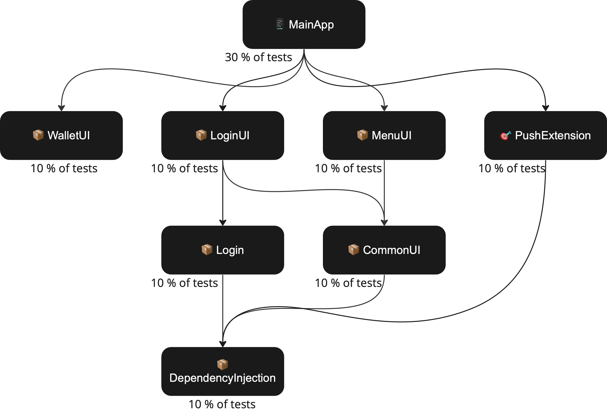
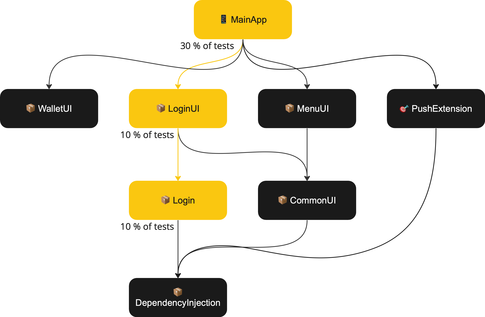
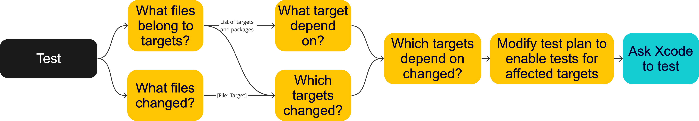

<style>
@font-face {
    font-family: "Poppins-Bold";
    src: url("theme/fonts/Poppins/Poppins-Bold.ttf");
}
@font-face {
    font-family: "Poppins";
    src: url("theme/fonts/Poppins/Poppins-Regular.ttf");
}
section {
  background: white;
  font-family: "Poppins";
  font-size: 10;
}
h1 {
  font-size: 36;
}
h1, h2, h3 {
  font-family: "Poppins-Bold";
  color: #d61f27;
}
</style>

# Make your app modular 
# @ 
# Test only what's changed


NB: Preliminary version 06.01.2023

---

# _TODO: About slide_

---

> “Insanity is doing the same thing over and over and expecting different results.”

Albert Einstein, probably

---

# Modules

Imagine, we have the following dependencies structure



---

# Change

If the _📦Login_ module is changed, it would only affect the _📦LoginUI_ and the _📱MainApp_.



---

# Does it make sense to test all the modules, if we know only the _📦Login_ module is changed?

---

 
 


---

# We can only run 50% of the tests and get the same results.


---

# But how can we know?

### 1. Detecting what is changed

Well, Git allows us to find what files were touched in the changeset. 

```bash
Root
├── Dependencies
│   └── Login
│       ├── ❗️LoginAssembly.swift
│       └── ...
├── MyProject.xcodeproj
└── Sources
```

---

### 2. Build the dependency graph

Going from the project to its dependencies, to its dependencies, to dependencies of the dependencies, ...

Can be achieved with _xcodeproj_ gem or a similar library.

Dependencies between packages can be parsed with `swift package dump-package`.

_BTW, This is the moment your Leetcode graph exercises would pay off_

---


---

### 2.5. Save the list of files for each dependency

This is important, so we'll know which files affect which targets.

---

## 3. Traverse the graph

Go from every changed dependency all the way up, and save a set of dependencies you've touched.


---

## 4. Disable tests that can be skipped in the scheme / test plan

This is actually the hardest part. Dealing with obscure Xcode formats. But if we get that far, we will not be scared by 10-year-old XMLs.

---

# Overview



---

# Sounds like fun, Mike

But I am not going to implement it now.

---

# Luckily, we implemented it already.

---


---

# Fastlane plugin test_changed

TODO: Github link

---

# Syntax

Exactly the same syntax as test/scan fastlane commands.

---

# What's next?


--- 

# Questions
