<style>
@font-face {
    font-family: "Outfit";
    src: url("theme/fonts/Outfit-Regular.ttf");
}
@font-face {
    font-family: "Outfit";
    src: url("theme/fonts/Outfit-Bold.ttf");
    font-weight: bold;
}
section {
  background: white;
  font-family: "Outfit";
  font-size: 10;
}
h1 {
  font-size: 64;
}
h1, h2, h3 {
  color: #101328;
}
header img {
  float: right;
  margin-right: 30px;

}
header {
  width: 100%;
}

</style>

# Streamlining iOS Development with Selective Testing

#### Michael Gerasymenko

Comments
- Time is limited
- Introduction can be shorter (could be cut for time)
- Mention swift testing / XCTest compatibility
- 10 min session, 5 min Q/A

<!--  -->

<br>

Swift Connection 2025

<!--  -->


<!-- _paginate: false -->

---

# Who I am

Hey, I'm Michael. I am originally from Ukraine 🇺🇦.

I started as an iOS engineer in 2009 at Readdle. Worked at Wire, Cara Care and Feeld.

Twitter: [@gk0io](https://twitter.com/gk0io)
Github: [mikeger](https://github.com/mikeger)
Email: mike@gera.cx
Web: https://gera.cx


---

# What is happening?

My hometown local charity fund:

https://monstrov.org


---

# Where I work

I am a Staff iOS engineer at Delivery Hero Logistics:

- Available in 70-something countries
- Serving over a million delivery drivers monthly

<!-- We are constantly hiring engineers. Reach out if you are interested. Or apply at https://careers.deliveryhero.com -->

---

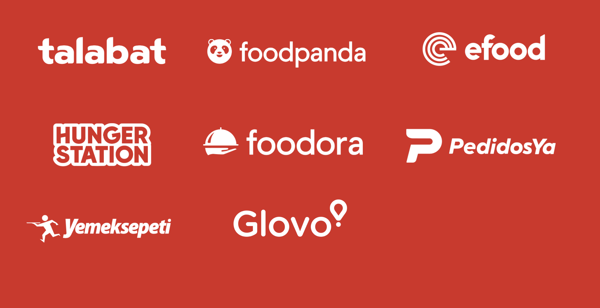

<!-- _header: '' -->
<!-- _footer: '' -->
<!-- _paginate: false -->

---

# Let's imagine you have a mobile application

There are some core jobs it is doing:

- Login and registration
- Preferences
- Home Interface
- Details Interface
- ...

---

# Growth

As your company is growing 🌱, so is your app. Over time, there would be multiple teams working on one application. Letting them **separate responsibilities** and allowing them to **own** their part of the application is crucial.

Each team can own a set of modules and some parts of the main application's code.


---

# Modular architecture

Modular architecture is a software design approach that prioritizes breaking down a program's functionality into **self-contained modules**. 

Each module encompasses all the required components to execute a specific aspect of the desired functionality.

 


---
<!--
# External dependencies

Your application probably already has some external dependencies, which are also modules:

- Crash reporting
- Analytics
- ...

---

# Some internal functionality can be separated as a module, too

For example:

- Dependency Injection
- Networking and Authentication
- Localization
- CommonUI, aka Design System

You can treat them as internally developed libraries.
-->

# Swift Package Manager or Projects/Targets?

SPM and Xcode support local packages, which allows for lightweight modularization:

```
Packages/
├── Networking/
│   ├── Package.swift
│   ├── Sources
│   └── Tests
├── Login/
...
```
<!-- _header: 'Mike Gerasymenko' -->


---

# In Xcode

- First-class citizen treatment: `Designed by Apple in California`
- Xcode can handle many packages well
- Dependencies between packages are supported
- External dependencies are also supported

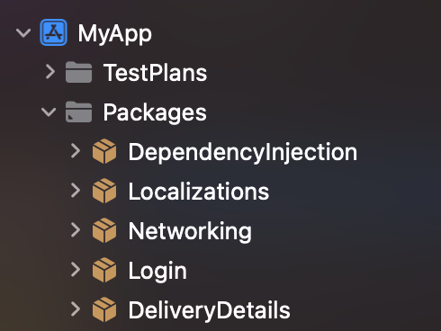
<!-- _header: '' -->

---

# Wait, there's more

- Adding individual files to SPM packages does not cause project file to change: you can forget about `project.pbxproj` conflicts
- You can open individual packages in Xcode to speed up the development
- ... and you can do selective testing 🚀


---

# Congratulations, now you have a modular application


---

> “Insanity is doing the same thing over and over and expecting different results.”

Albert Einstein, probably

---

# Modules

Imagine we have the following dependencies structure

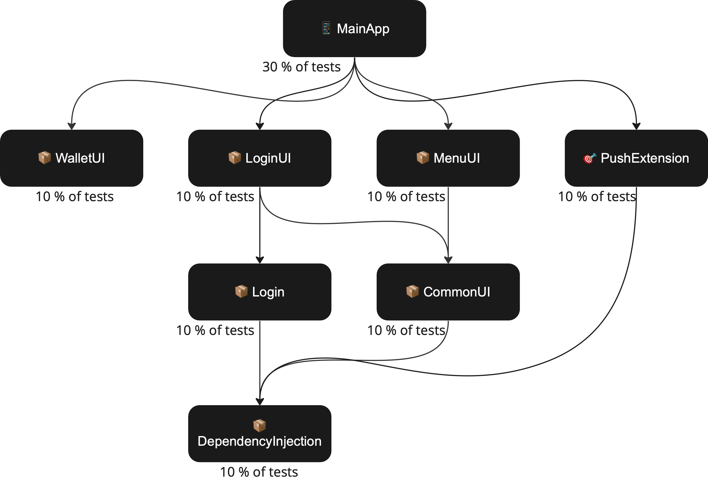
<!-- _header: 'Mike Gerasymenko' -->

---


# Running all those tests is taking so much time!

---

# Change


If the _📦Login_ module is changed, it would only affect the _📦LoginUI_ and the _📱MainApp_.

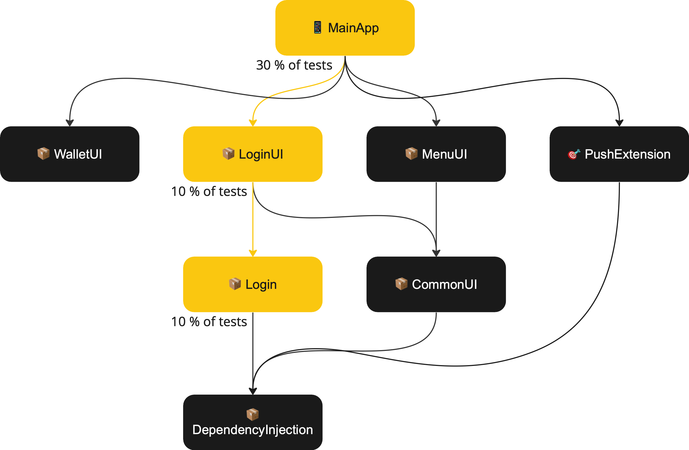
<!-- _header: 'Mike Gerasymenko' -->
---


# Does it make sense to test all the modules, if we know only the _📦Login_ module is changed?


<!-- 
---

 
 
-->
<!-- _header: '' -->
<!-- _footer: '' -->
<!-- _paginate: false -->

--- 


# We can only run 50% of the tests and get the same results

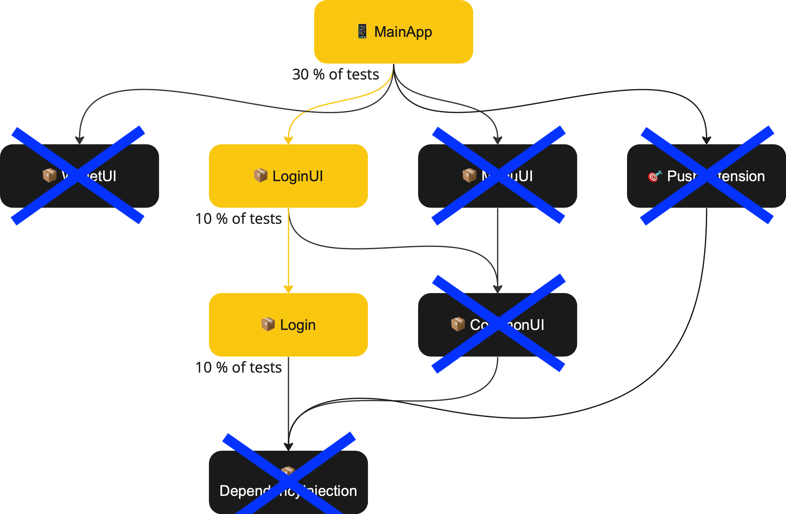


<!-- _header: 'Mike Gerasymenko' -->
---

# But how can we know?

### 1. Detecting what is changed

Well, Git allows us to find what files were touched in the changeset. 

```bash
Root
├── Dependencies
│   └── Login
│       ├── ❗️LoginAssembly.swift
│       └── ...
├── MyProject.xcodeproj
└── Sources
```

---

### 2. Build the dependency graph

Going from the project to its dependencies, to its dependencies, to dependencies of the dependencies, ...

This can be achieved with _XcodeProj_ package from Tuist.

Dependencies between packages can be parsed with `swift package dump-package`.


<!--

---


-->
---

### 2.5. Save the list of files for each dependency

This is important so we'll know which files affect which targets.

---

## 3. Traverse the graph

Go from every changed dependency all the way up, and save a set of dependencies you've touched.


<!-- _header: 'Mike Gerasymenko' -->
---

## 4. Disable tests that can be skipped in the scheme/test plan

This is the most challenging part. We are dealing with obscure Xcode formats. But if we get that far, we will not be scared by that.

---

# Overview


---

# Sounds like fun, Mike

But I am not going to implement it now.

---

# Luckily, we implemented it already.

<!-- 


 -->

<!-- _header: '' -->
<!-- _footer: '' -->
<!-- _paginate: false -->

---

<style>
img[alt~="center"] {
  display: block;
  margin: 0 auto;
}
</style>

<!--  -->
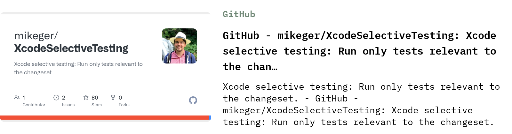

[github.com/mikeger/XcodeSelectiveTesting](https://github.com/mikeger/XcodeSelectiveTesting)


---

# Benefits

We observed 40-50% average CI time reduction when using XcodeSelectiveTesting

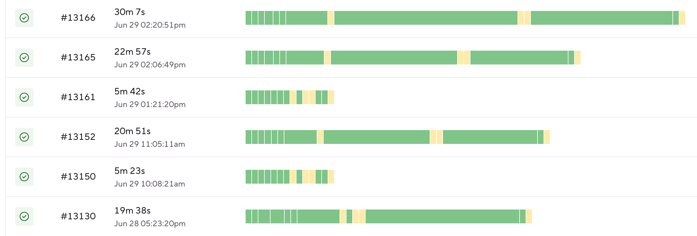

---

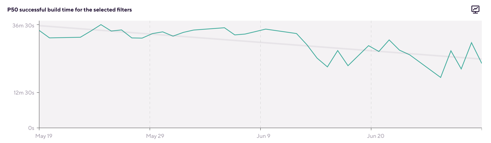

---

# Why testing fast and precise is important?


- Faster CI run means consuming less natural resources
- Local test runs are saving developer hours
<!-- _header: '' -->

---

# Pitfails (TODO)

- Coverage reports
- Flaky tests

---

# Be an open-source maintainer!

---

# Honorable mentions

- Tuist

---

TODO: 

Also, can be cut for time

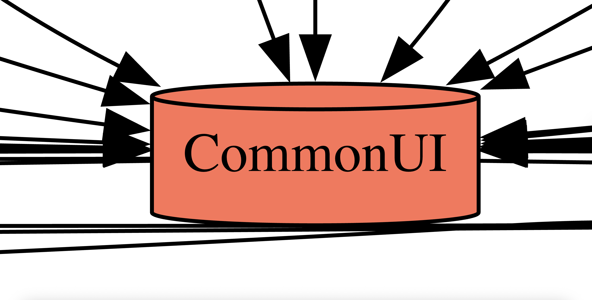

---


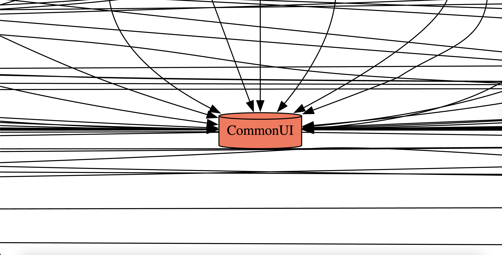

---


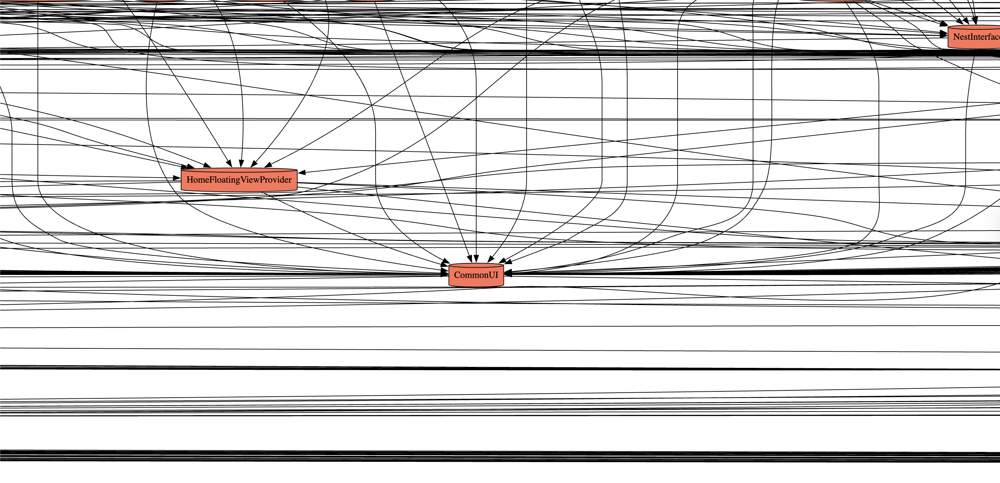

---


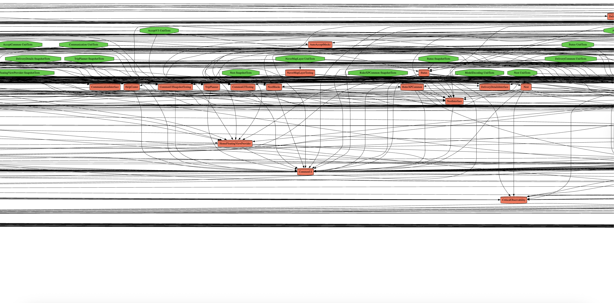

---


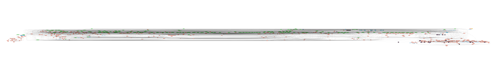

---

# What's next?

--- 

# Questions

Slides: []()
