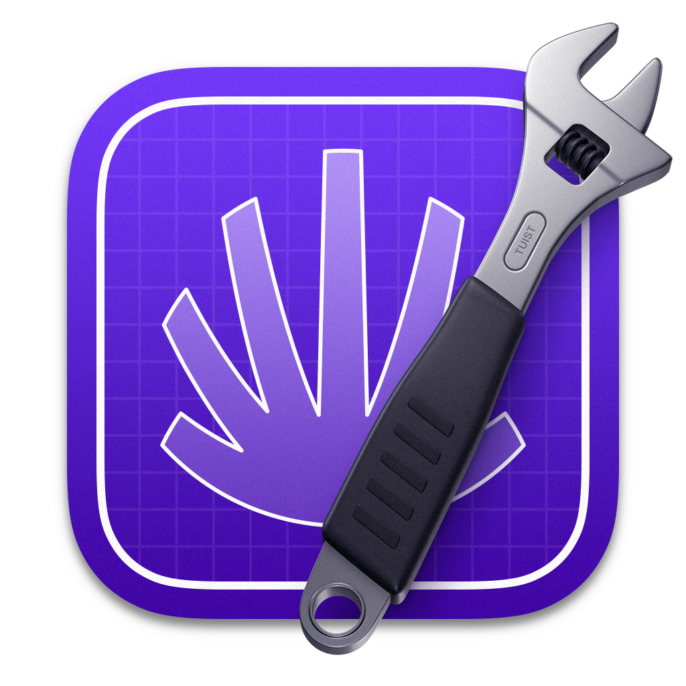

<style>
@font-face {
    font-family: "Outfit";
    src: url("theme/fonts/Outfit-Regular.ttf");
}
@font-face {
    font-family: "Outfit";
    src: url("theme/fonts/Outfit-Bold.ttf");
    font-weight: bold;
}
section {
  background: white;
  font-family: "Outfit";
  font-size: 10;
}
h1 {
  font-size: 64;
}
h1, h2, h3 {
  color: #101328;
}
header img {
  float: right;
  margin-right: 30px;

}
header {
  width: 100%;
}

</style>

# Streamlining iOS<sup>*</sup> Development with Selective Testing

#### Michael 'Mike' Gerasymenko

<sup>*</sup>Actually, any Swift code

<!-- Comments
- Time is limited
- Introduction can be shorter (could be cut for time)
- Mention swift testing / XCTest compatibility
- 10 min session, 5 min Q/A -->

<!--  -->

<!--  -->


<!-- _paginate: false -->


---


---

# Hey Mike...

---

# We are interested in your talk!

---

# Just...

---

# Can it be a lightning talk?

---


<!-- 
---

# Who I am

Hey, I'm Michael. I am originally from Ukraine 🇺🇦, based in Berlin 🇩🇪

Started as an iOS engineer in 2009:
- Readdle
- Wire
- Cara Care
- Feeld

Github: [mikeger](https://github.com/mikeger)
Web: https://gera.cx


---

# Where I work

Today, a Staff iOS engineer at Delivery Hero Logistics:

- Available in 70-something countries
- Serving over a million delivery drivers monthly

 -->

<!-- _header: '' -->
<!-- _footer: '' -->
<!-- _paginate: false -->

---

# How many of you are writing tests? No blaming!


---

# Happy with how long it takes to run them?

---

# Your mobile application

There are some core jobs it is doing:

- Login and Registration,
- Preferences,
- Home UI,
- Details UI,
- ...

---

# Growth

As your company grows 🌱, so does your app. Over time, multiple teams would work on a single application. Letting them **separate responsibilities** and allowing them to **own** their part of the application is crucial.

Each team can own a set of modules and some parts of the main application's code.


<!-- ---

 

 -->
---
<!--
# External dependencies

Your application probably already has some external dependencies, which are also modules:

- Crash reporting
- Analytics
- ...

---

# Some internal functionality can be separated as a module, too

For example:

- Dependency Injection
- Networking and Authentication
- Localization
- CommonUI, aka Design System

You can treat them as internally developed libraries.
-->
<!-- 
# Swift Package Manager or Projects/Targets?

SPM and Xcode support local packages, which allows for lightweight modularization:

```
Packages/
├── Networking/
│   ├── Package.swift
│   ├── Sources
│   └── Tests
├── Login/
...
```


 -->
<!-- 
# In Xcode

- First-class citizen treatment: `Designed by Apple in California`
- Xcode can handle many packages well
- Dependencies between packages are supported
- External dependencies are also supported


---

# Wait, there's more

- Adding individual files to SPM packages does not cause project file to change: you can forget about `project.pbxproj` conflicts
- You can open individual packages in Xcode to speed up the development
- ... and you can do selective testing 🚀


---

# Congratulations, now you have a modular application


<!-- 
---

> “Insanity is doing the same thing over and over and expecting different results.”

Albert Einstein, probably 


---
-->

# Modules


<!-- _header: 'Michael "Mike" Gerasymenko' -->

---


# Running all those tests is taking so much time!

---


If the _📦Login_ module is changed...


<!-- _header: 'Michael "Mike" Gerasymenko' -->

---


It would only affect the _📦LoginUI_...


<!-- _header: 'Michael "Mike" Gerasymenko' -->

---


And the _📱MainApp_...


<!-- _header: 'Michael "Mike" Gerasymenko' -->

---


# Does it make sense to test all the modules, if we know only the _📦Login_ module is changed?

--- 


# We can only run 50% of the tests and get the same results


<!-- _header: 'Michael "Mike" Gerasymenko' -->
---

# But how can we know?

### 1. Detecting what is changed

Git allows us to find what files were touched in the changeset. 

```bash
Root
├── Dependencies
│   └── Login
│       ├── Package.swift
│       ├── Sources
│       │   └── ❗️LoginAssembly.swift
│       └── ...
├── MyProject.xcodeproj
└── Sources
```


<!-- _header: 'Michael "Mike" Gerasymenko' -->
---

### 2. Build the dependency graph, save the list of files for each dependency

Going from the project to its dependencies, to its dependencies, to dependencies of the dependencies, ...

This can be achieved with the _XcodeProj_ package from Tuist.

Dependencies between packages can be parsed with `swift package dump-package`.

This is the most challenging part. We are dealing with obscure Xcode formats. But if we get that far, we will not be scared by that.

---

## 3. Traverse the graph, disable tests that can be skipped in the scheme/test plan

Go from every changed dependency all the way up, and save a set of dependencies you've touched.

<!-- _header: 'Michael "Mike" Gerasymenko' -->

---

# Sounds like fun, Mike

But I am not going to implement it now.

---

# Available Today!

<style>
img[alt~="center"] {
  display: block;
  margin: 0 auto;
}
</style>

<!--  -->


# [github.com/mikeger/XcodeSelectiveTesting](https://github.com/mikeger/XcodeSelectiveTesting)


---

# What does it bring?
<!-- 
We observed a 40-50% average CI time reduction when using XcodeSelectiveTesting. -->


<!-- 
---


---

# Why testing fast and precise is important?


- Faster CI run means consuming less natural resources
- Local test runs are saving developer hours
_header: '' -->

---

# Support

- Xcode Projects, also with buildable folders
- Swift Testing
- XCTest + UI Tests
- SPM packages

---

# Support

- Xcode Projects, also with buildable folders
- Swift Testing
- XCTest + UI Tests
- SPM packages
- Even Linux! Ask Marcin 


---

# Pitfalls

- Code coverage reports must be uploaded per module. Otherwise, every run you would get different (bad) coverage.
- Flaky tests might be merged and stay in the repo for a while until someone touches them.

---

# Open-source is awesome

- Make friends.
- Let your future employer already benefit from your code.
- Other people fix your bugs.


<!-- _header: 'Michael "Mike" Gerasymenko' -->
---

# Open-source is awesome

- Make friends.
- Let your future employer already benefit from your code.
- Other people fix your bugs.
- Maybe even speak on stage!

- **I would like to thank all contributors!**


<!-- _header: 'Michael "Mike" Gerasymenko' -->

---

# What about other solutions?

- **Tuist** also supports selective testing.

- Has a different principle: Target contents are hashed, and after the test is successful, it's saved on the Tuist.dev cloud.

- Downsides: it is paid.

- Upsides: fewer test runs for feature branches.

<!-- _header: 'Michael "Mike" Gerasymenko' -->



---


---

# Fin<i>!</i>

---

# Or not?

---

# Modularization allows Selective Testing. 
# What else?

---

# Modularization

- Clear ownership
- Foster API design
- AI has a way to reason about your code's context — it's module

---

# Thank you!

<!-- AI used for proofreading -->

Illustrations by Alexander Gerasymenko
<!-- 
Sunflower by Wolfgang Hasselmann, Gleb Paniotov -->


<!-- _header: 'Michael "Mike" Gerasymenko' -->
<!-- 
---

TODO: 

Also, can be cut for time


---


---


---


---


 -->
