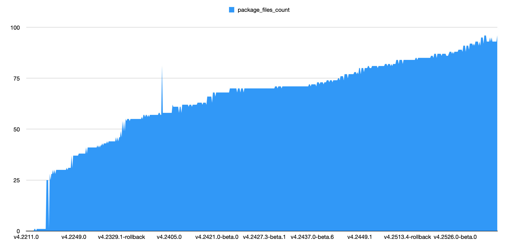
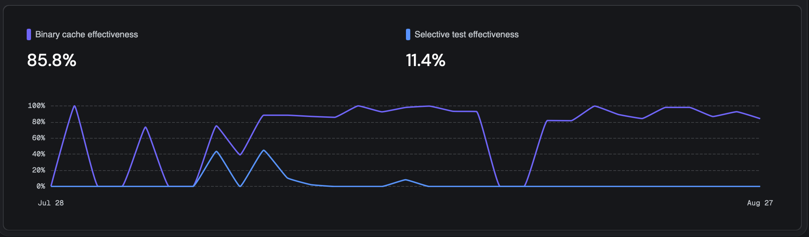
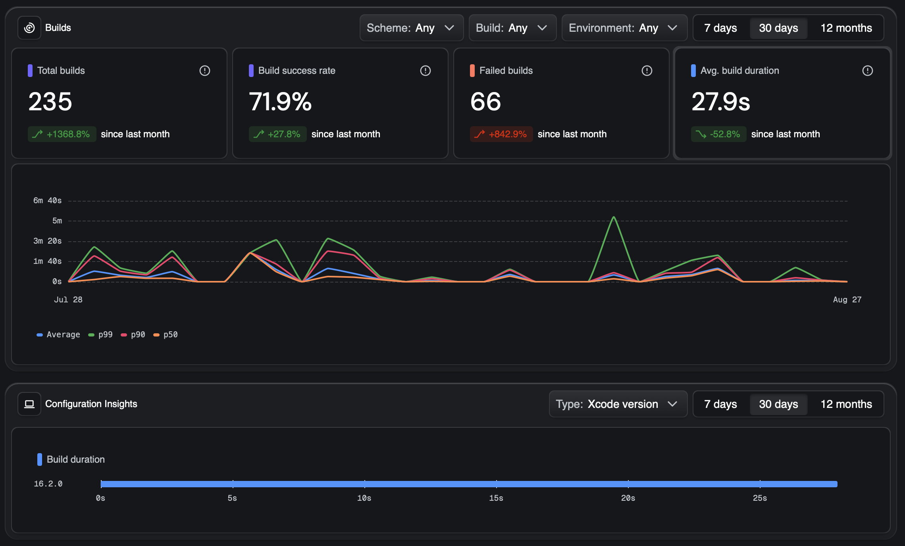

<style>
@font-face {
    font-family: "Outfit";
    src: url("theme/fonts/Outfit-Regular.ttf");
}
@font-face {
    font-family: "Outfit";
    src: url("theme/fonts/Outfit-Bold.ttf");
    font-weight: bold;
}
section {
  background: white;
  font-family: "Outfit";
  font-size: 10;
}
h1 {
  font-size: 64;
}
h1, h2, h3 {
  color: #101328;
}
header img {
  position: absolute;
  top: 10px;
  right: 30px;
}
header {
  
  width: 100%;
  padding-right: 0;
}
</style>


# 🚀 Tuist Integration in Rider App

Migration to Tuist to manage projects and dependencies.  
Goal: faster builds, clearer structure, better scalability.

---

# 📌 What is Tuist?

- Tool to manage Xcode projects at scale  
- Generates `xcodeproj` & `xcworkspace` from manifests (`Project.swift`)  
- Provides:
  - Faster compilation (local & CI)
  - Infrastructure-as-code for projects
  - Better developer experience

---

# 🔑 Key Tuist Components

- **Tuist CLI Utility**  
- **Tuist Online Service**  
- `Project.swift` → defines module manifest  
- `Workspace.swift` → defines the workspace

---

# 🏁 Migration Path (Start Point)

- Rider app already in **monorepo**  
- Using **SPM** currently  

---

# Rider app modularization

- **96 modules**  
- Modules are rapidly increasing  



---

# 🔄 Migration Steps

1. Tried reusing SPM manifests → ❌ not working (no test targets for local pkgs)  
2. Rewrote **all `Package.swift` → `Project.swift`**  
3. Created **top-level manifest**  
4. Used **LLM (Gemini agent) for 36h** → automated migration (`tuist generate` verified)

---

# 📂 Structure of Tuist Integration

- `Workspace.swift` → root workspace  
- `Project.swift` → per-module definitions  
- `Tuist/`
  - `Package.swift` → external dependencies  
  - `Binary/` → binary 3rd-party deps  
  - `Configs/` → shared `.xcconfig`  
  - `ProjectDescriptionHelpers/` → helper methods

---

# ⚙️ Tuist Workflow

Login to the online services:  

```bash
tuist auth login
```

---

# Edit manifests:

```bash
tuist edit
```

---

# ☁️ Server-side Caching

 - Tuist provides binary caching for modules
 - Cache can be warmed on CI and pulled by developers
 - Benefits:
 - Faster onboarding (less local compilation)
 - Consistent builds across developers & CI
 - Less CPU/memory load locally

---

# 📦 Tuist Commands (1/4)

Generate workspace

```bash
tuist generate
```

Generate Roadrunner project

```bash
tuist generate Roadrunner
```

---

# 📦 Tuist Commands (2/4)

Generate keeping target as sources

```bash
tuist generate AcceptCommon
```

Generate without cache

```bash
tuist generate --no-binary-cache
```

---

# 📦 Tuist Commands (3/4)

Generate by squad (code ownership)

```bash
tuist generate tag:lrtmi
```

Squads:
ravl, rotw, ropd, lrtmi, rtoa, racc, ios, rxp

---

# 📦 Tuist Commands (4/4)

Generate by domain

```bash
tuist generate tag:mobile-infra
```

Domains:

- rider-fundamentals
- mobile-infra
- delivery-flow

---

# Generation in practice


---

# 🤖 CI Integration

On every merged PR → CI runs:

```bash
tuist cache
```

 - This ensures cache is always up-to-date
 - Developers pull cached binaries instead of compiling everything
 - Dramatic reduction of CI pipeline time

---

# ✅ Outcomes
 - 🚀 Build time improvements (local & CI)
 - 🧩 Manifest definition via shared ProjectDescriptionHelpers
 - 📐 Project infra as code → reproducible & maintainable

---

# ⚡️ Build Time Improvements

| Build type        | Current state | Tuist (binary) | Tuist (4 as source) |
|-------------------|--------------|----------------|----------------------|
| Clean build       | 148s         | 27s (-81%)     | 34s (-77%)          |
| Incremental build | 34s          | 13s (-61%)     | 13s (-61%)          |

--- 

# Binary cache insights



--- 

# Build insights

Provided by Tuist automatically



--- 

# Selective testing

- Out of the box, but we still need to gather insights on this one

---

# 🔮 Next Steps
 - Team to migrate fully from SPM to Tuist
 - Remove old `Rider.xcworkspace` & `Package.swift` setup
 - Explore dependency types (feature, testing, utilities)

---

# Known limitations and quirks

- Not possible to binary cache targets migrated to XCTest
- Debugging is sometimes challenging with cached modules (missing "pch" files for no reason)
`Debugging will be degraded due to missing types. Rebuilding the project will regenerate the needed module files.`
- SPM infer which targets are linking to the test targets as test helpers and give them flags that allow linking to XCTest & co.
- We actually ironed out about 4 quirks with the Tuist team, so not much to add here

---

# ⚠️ What We Still Use Old Setup For
 - Tests → still running via old SPM/xcworkspace setup
 - App Store builds → still using old pipeline for safety
 - Tuist adoption is gradual & hybrid at this stage

---

# 🎯 Summary
 - Tuist improves build speed & developer experience
 - Migration is already underway (with automation help)
 - Clearer structure, scalable to 100+ modules
 - Next step: full adoption by the team

 Channel to join: #ext-tuist-poc

---

# Questions

## Thank you!
