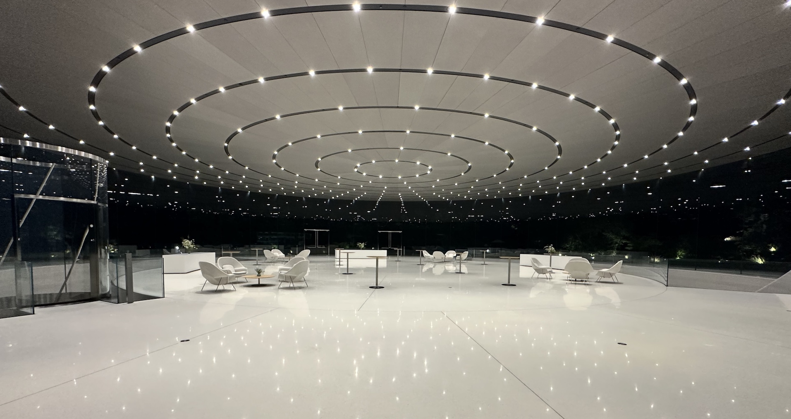
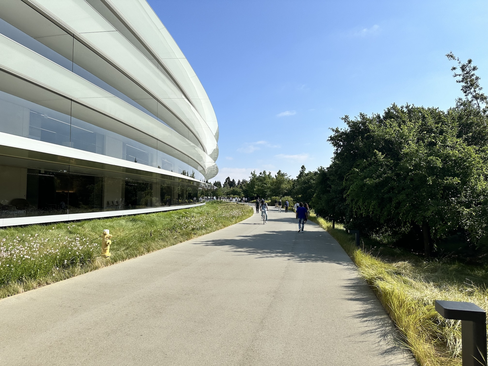
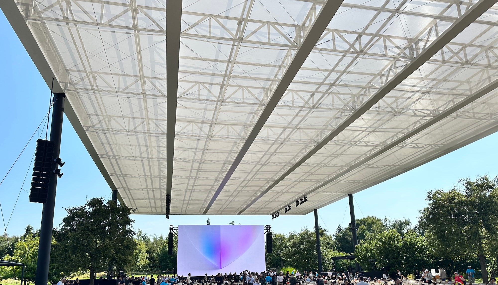
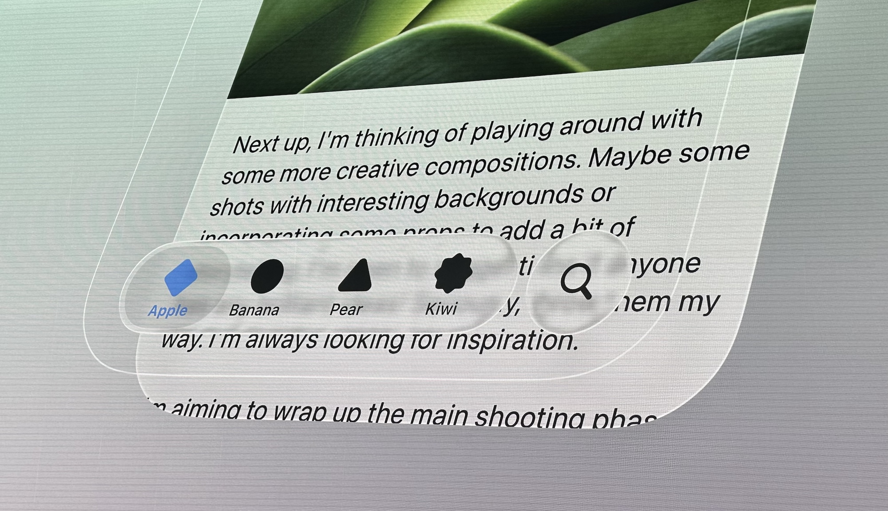
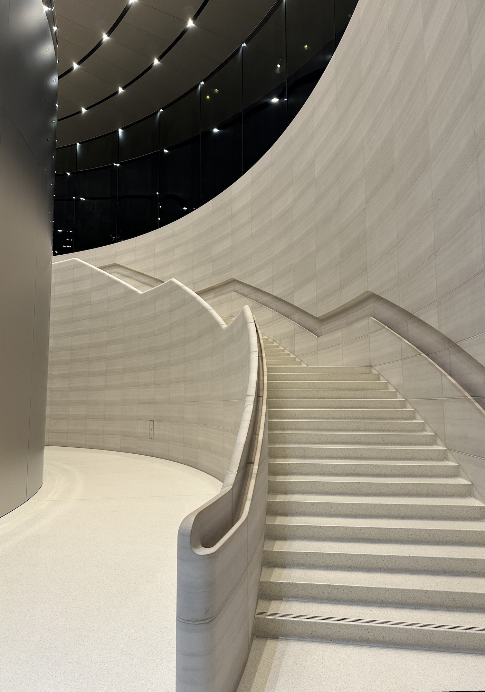
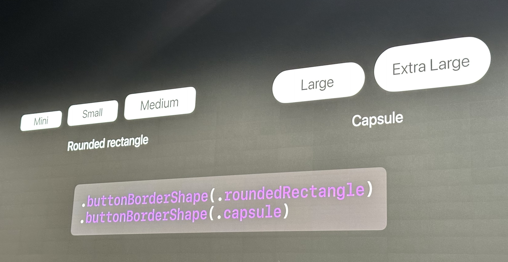
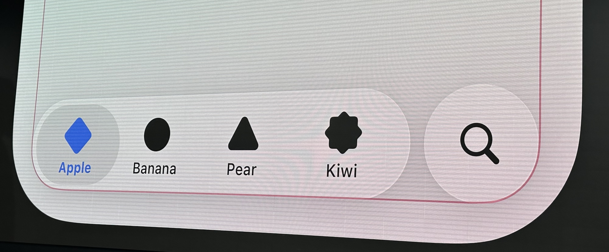
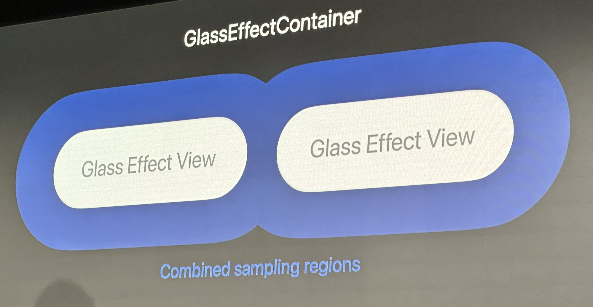
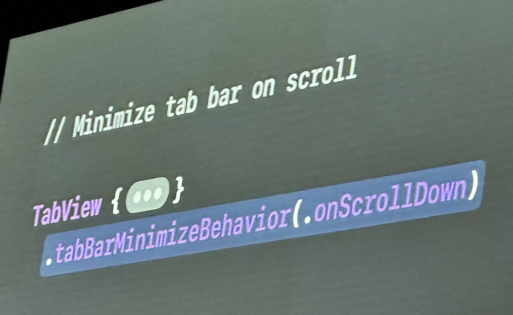
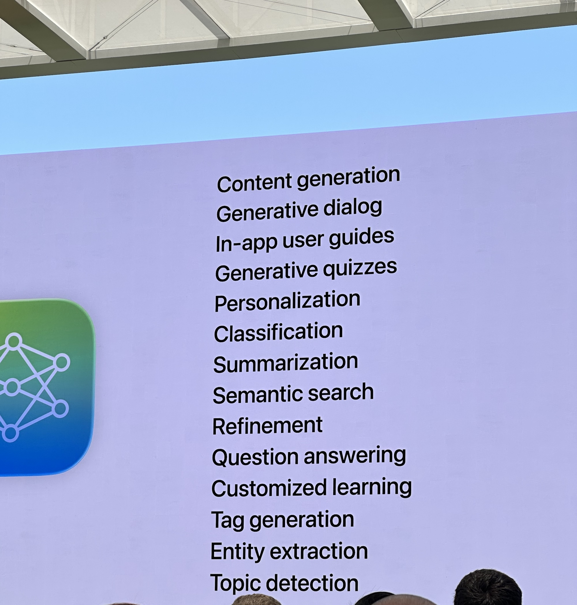

<style>
@font-face {
    font-family: "Outfit";
    src: url("theme/fonts/Outfit-Regular.ttf");
}
@font-face {
    font-family: "Outfit";
    src: url("theme/fonts/Outfit-Bold.ttf");
    font-weight: bold;
}
section {
  background: white;
  font-family: "Outfit";
  font-size: 10;
}
h1 {
  font-size: 64;
}
h1, h2, h3 {
  color: #101328;
}
header img {
  position: absolute;
  top: 10px;
  right: 30px;
}
header {
  
  width: 100%;
  padding-right: 0;
}
</style>

# WWDC special event

June 9th 2025

---



# What is WWDC special event

Most of the conference and content remain accessible online. However, since 2022 there have been special activities for those interested in Apple tech

Attendance is free. Travel and accommodations must be self-organized, usually covered by an educational budget

---

## Why travel to WWDC?



- A rare opportunity visiting Apple Park
- Meet engineers and designers worldwide
- Ask Apple employees questions in in-person labs

I met people like Ben Cohen (Swift), Chris Eidhof (objc.io), and Paul Hudson (Hacking with Swift). Their insights were invaluable.

---

## How WWDC events happen & how to attend


- Annual updates: iOS, macOS, visionOS, Xcode, Swift, etc.
- Two ways to attend:
  - Apple Student Challenge winner
  - Apple Developer lottery (~1200-1500 attendees)

Thanks to Delivery Hero and my managers for supporting my trip!

---

## In-person Event



Held on-site at Apple Park.

Activities:
- Watch Keynote & Platforms State of the Union.
- Attend Apple Design Awards live.

---

## Labs

Second part of the day: labs

What happens:
- Talk to Apple employees
- Ask about AppStore, frameworks, APIs, etc.

Labs are direct, hands-on, and provide real-time answers.

---



## Developer Activities

- Held in the Developer Center, next to Apple Park.
- Presentation on Liquid Glass.
- Q&A with Apple designers and developers.

Much more engaging than watching videos online!

---

## F1 Movie Screening



Apple invited developers for a pre-screening of the F1 movie.

Location: Steve Jobs Theater  
Where new iPhones are announced  
Stunning architecture, underground cinema.

---

# What’s New?

Plenty of blogs already covered the general WWDC news.

Here are my favorite sources:

- [Xcode 26 release notes](https://developer.apple.com/documentation/xcode-release-notes/xcode-26-release-notes)
- [Developer experience wins](https://tuist.dev/blog/2025/06/10/wwdc)
- [Swift 6.2 concurrency changes](https://www.donnywals.com/exploring-concurrency-changes-in-swift-6-2/)
- [Actor isolation in Xcode 26](https://www.donnywals.com/setting-default-actor-isolation-in-xcode-26/)
- [SwiftUI for iOS 26](https://www.hackingwithswift.com/articles/278/whats-new-in-swiftui-for-ios-26)

---

## Must-watch Talks

- [What’s new in Swift](https://developer.apple.com/videos/play/wwdc2025/245/)
- [What’s new in UIKit](https://developer.apple.com/videos/play/wwdc2025/243/)
- [Swift concurrency](https://developer.apple.com/videos/play/wwdc2025/268/)
- [Memory & performance](https://developer.apple.com/videos/play/wwdc2025/312/)
- [CPU performance with Instruments](https://developer.apple.com/videos/play/wwdc2025/308/)

---

## Should-watch Talks

- [SwiftUI updates](https://developer.apple.com/videos/play/wwdc2025/256/)
- [SwiftUI performance](https://developer.apple.com/videos/play/wwdc2025/306/)

---

## Liquid Glass


- Big UI redesign for iOS 26
- Reminiscent of skeuomorphic designs
- Based on Metal, shaders, and hardware-software integration
- Very _fluid_ and playful

[Meet Liquid Glass](https://developer.apple.com/videos/play/wwdc2025/219/)

---

## New button shapes



---

## Corner radius logic



---


## Glass effect container to join glass surfaces



---

## Tab minimizing behavior



---

## Xcode AI Tools


- AI tools in Xcode 26 enhance developer productivity
- Expect new AI tools throughout the year

[What’s new in Xcode 26](https://developer.apple.com/videos/play/wwdc2025/247/)

---

## Foundation Models



Apple introduces a new framework: **Foundation Models**

- On-device LLMs
- Integrated with the OS
- No bundling required
- Unlocks new app features (e.g., reply suggestions)

[Deep dive into Foundation Models](https://developer.apple.com/videos/play/wwdc2025/301/)

---

## Additional topics

- Call translation API
- Order tracking in the Wallet
- `#Playground` macro
- New performance instruments (SwiftUI and better sampling on M4)
- InlineArray
- Icons and IconComposer


---

# Answers to the questions team prepared

---

## Question 1:  Will UITests be supported by the new Swift Testing framework in the future?

Their intention is to make Swift Testing a tool that would allow all types testing on Apple platforms.

My translation: UI tests would be supported on Swift Testing eventually, but they cannot commit to a specific date

---

## Question 2: What can cause the app to start but never come to the foreground? App prewarming is excluded

They recommend using Metrics Kit to collect data from the device. The described issue is not known to them.

---

## Question 3: Testing async code, with detached Tasks, or with combine, async stream
To add the description

The question I’ve clarified was connected to the following problem:

We have a SUT that consumes an async stream of events. This SUT then changes it’s internal state. Test wants to assert the change happening. There is no way as of now to know from the test when SUT finished consuming all the events from the stream, hence there is a need to have a waiting code.

---

Example: 

```
    func test_firstDelivery_doesNotTriggerAnyCalls() async {
        // prevFlowState is nil, so even if it's .accept we do nothing
        continuation.yield(DeliveryFlowModel.make(state: .accept))
        try? await Task.sleep(nanoseconds: 50000000)

        XCTAssertNil(stateProvider.setDisplayModeCalledWith)
    }
```

-> It should be possible to make setDisplayModeCalledWith observable and wait for the expectation

---

## Question 4: Metrics in Organisers

Not all hangs are displayed in the organizer as some are considered minor if they appear only few times. The hangs are collected from devices where the user shared a consent when setting up iOS to share analytics with developers. 
Apple recommend using MetricsKit to collect all information available in Xcode Organizer but on all devices. Then it’s up to us to collect the consent from users.

Difference between hangs and hang rate is that one is intended to provide a statistical overview (hang rate) and the hangs are providing opportunity to see specific stack traces causing the hang.

---

## Question 5: Usage of -only-testing / -skip-testing with Swift Testing

They assume you can continue using the existing format, it should support all characters, except separator characters as the CLI might get confused. Just put the names in quotes. They claim it should all work, and if not ask to raise the Radar issue.

---

## Question 6: XcodeSelectiveTesting integration with Xcode best strategy

They liked the idea. New idea I got was that they kind of hinted that using automator / external app to steer Xcode from the plugin should be working.

---

## Question 7: Accessibility with adjustable fonts using horizontal collection view

Complex question, but the general direction I understand was the following:
- In collection view, in general you don’t want to lay out too many items, as it could contain quite many elements
- Dynamic type is known during the layout, and the type change is an event that does not happen too frequently. So it’s acceptable to re-layout everything if the type is changed
- It’s not recommended to make collection view height dynamic as you scroll, as it would make the UI jump vertically
- They did not understand the accessibility aspect of the question

---

# Some more things

## Why Organizer data is not displayed via a web interface?
They don’t have resources developing it
They admit making it a part of Xcode makes not too accessible for developers using third-party tools to build apps (like unity, etc.)

---

## How Liquid Glass is working?

- Several layers, most likely using Metal shaders
- Extending over the edges of the styled view to capture content to be refracted
- One layer on the background
- One layer for the foggy design
- Third layer on top mimicking the reflection
- If we want to know more, we should do the reverse engineering ourself

---

## How to adopt an existing design system when moving to Swift UI?

They recommend to re-implement UI components in Swift UI and not to use UIViewRepresentable

---

## Quirks of the UIKit development setup

- Only two modules, UIKit and UIKitCore (correspondingly, two targets)
- Until recently, some parts not using ARC
- Around 20 minutes cold compilation time


---

# Thank you!

Time for questions